# Plan post-9.6 — Agent A / Agent B

## Démarrage rapide

| Rôle | Instruction |
|------|-------------|
| **Coordinateur** | Lire § Coordinateur ; **C0bis** puis **C0** ; lancer A et B (**C1**) ; ne pas exécuter leurs missions. |
| **Agent A** | Nouveau chat : *« Tu es **Agent A**. Lis et exécute la section **Agent A** du plan `.cursor/plans/post-9.6_plancher_et_compta_3341de2e.plan.md`. »* |
| **Agent B** | Nouveau chat : *« Tu es **Agent B**. Lis et exécute la section **Agent B** du plan `.cursor/plans/post-9.6_plancher_et_compta_3341de2e.plan.md`. »* |

**Un chat = un rôle.** Ne pas mélanger A et B.

**Gate C0bis (cible à obtenir, avant C1) :** publier le rapport [references/artefacts/2026-05-26_04_qa2-plan-post-9-6-plancher-compta.md](references/artefacts/2026-05-26_04_qa2-plan-post-9-6-plancher-compta.md) sur disque avec **P0 plan = 0** et score ≥ 95 %. Ce gate n’est **pas** acquis par défaut — **C1 interdit** tant que ce rapport n’existe pas avec ces critères.

```mermaid
flowchart TB
  C0bis[C0bis_gate_plan_QA2]
  C0[C0_commit_9_6]
  C1[C1_lancer_A_B]
  Coord[Coordinateur]
  A[Agent_A]
  B[Agent_B]
  PauseB[Pause_DS_B]
  HITL[HITL_Strophe_C2b]
  C2a[C2a_rapport_QA2]
  C2b[C2b_signoff]
  C3[C3_sync_doc]
  C0bis --> C0 --> C1
  C1 --> Coord
  Coord --> A
  Coord --> B
  A --> TaskA[Task_sous_agents]
  A --> QA2A[qa2_rapport_03_seul]
  B --> TaskB[Task_sous_agents]
  B --> QA2B[qa2_story_code]
  A -.->|ecart_bloquant_fermeture| PauseB
  PauseB -.-> B
  QA2A --> C2a --> HITL --> C2b
  QA2B --> Coord
  C2b --> C3
```

*Vue orchestration complète (C0bis→C3, pause B, HITL). Les flèches pointillées = C-sync.*

---

## Contexte (commun)

- **9.6** : `done` — [`9-6-config-admin-simple-modules.md`](_bmad-output/implementation-artifacts/9-6-config-admin-simple-modules.md).
- **Produit** : dépôt = **v2.0** ; prod réf. = **1.4.4** (autre Git) ; **2.0.1+** = un module à la fois ; **HelloAsso**, **9.1**, **9.7** = pas maintenant.
- **Brief 02 — fil E (EC)** : avant **C1**, lire la **dérogation EC** (gate waived dev / blocking prod) dans [`references/artefacts/2026-05-26_02_brief-bmad-remise-a-flot-modules-9-6.md`](references/artefacts/2026-05-26_02_brief-bmad-remise-a-flot-modules-9-6.md) — évite de relancer le débat comptable au lancement des chats A/B.

---

## Règles d’orchestration (Agent A et B)

1. **Parent = routeur** — déléguer le travail lourd via **`Task`** (`explore` / `generalPurpose`, modèle **auto**). Ne pas ingérer tout le repo dans le chat parent.
2. **QA sur chaque livrable** — invoquer **`@qa2-orchestrator`** avec brief aligné sur `C:\Users\Strophe\.cursor\skills\qa2-agent\workflow.md` (+ `workflow-loop.md` si boucle) et gabarit `C:\Users\Strophe\.cursor\skills\qa2-agent\references\qabrief-template.md`. **Gate score ≥ 95 %** ; **P0 ouvert dans le rapport QA2 = gate non atteint** même si le score affiché est ≥ 95 % (`workflow-loop.md`).
3. **Owners fichiers**

| Fichier | Owner |
|---------|--------|
| `references/artefacts/2026-05-26_02_brief-bmad-remise-a-flot-modules-9-6.md` | Coordinateur (sync C3 ; lecture A/B) |
| `references/artefacts/2026-05-26_03_*` | Agent A |
| `_bmad-output/implementation-artifacts/*liaison-paheko*` | Agent B |
| `references/ou-on-en-est.md`, `sprint-status.yaml` | Coordinateur |
| `references/protocole-modules-recyclique/` | Agent B si cookbook ; A lecture seule |

4. **Sync A ↔ B (fermeture caisse)** — protocole **C-sync** (tableau § Coordinateur). Résumé : écart bloquant A → pause DS B → GO Coordinateur documenté → reprise B.
5. **Parallélisme A / B (tranché)** — exploration et rédaction story B **en parallèle** de A. **`bmad-dev-story` (DS code)** pour B **uniquement après** : (a) livrable A contenant une section **fermeture caisse** (brouillon rapport `…03_…` acceptable), **ou** (b) **GO Coordinateur** explicite dans le chat Coordinateur (copier la phrase dans la story). Aligné **stratégie 2.0.1** du brief 02 : plancher **v2.0** d’abord, module liaison Paheko **après** parité gestes ; le fil **E** (liaison v1) avance sous **dérogation EC** (§ Agent B), pas en contournant C-sync.

---

## Coordinateur

| Étape | Action | Gate / DoD |
|-------|--------|------------|
| **C0bis** | **Cible** gate qualité de ce plan : **publier** le rapport [`references/artefacts/2026-05-26_04_qa2-plan-post-9-6-plancher-compta.md`](references/artefacts/2026-05-26_04_qa2-plan-post-9-6-plancher-compta.md) avec **P0 plan = 0**, score ≥ 95 % (boucle QA2 plan si besoin). Non acquis tant que le fichier n’existe pas sur disque avec ces critères. | **Bloquant** avant C1 — **C1 interdit** sinon |
| **C0** | Commit jalon **9.6** — `@git-specialist` ou manuel : `feat(modules): close story 9.6 …` | **Recommandé fort** ; **obligatoire** si le dépôt a des changements 9.6 non commités |
| **C1** | Ouvrir 2 chats Agent A / B (§ Démarrage rapide) | C0bis OK |
| **C2a** | Rapport A livré + QA2 rapport ≥ 95 %, P0 rapport = 0 | Chemins : `references/artefacts/2026-05-26_03_*` |
| **C2b** | **HITL Strophe** — validation humaine matrice gestes (30–60 min, 3–5 parcours critiques) | Sign-off explicite (chat ou note datée dans le rapport) |
| **C3** | Sync `ou-on-en-est.md`, `brief 02`, `sprint-status.yaml` | **Prérequis : C2b complété** (sign-off HITL Strophe). Story B `done` + QA2 B ≥ 95 % si DS engagé ; **interdit tag `v2.0.0`** tant que **C2b** non fait |

**Checklist livrables Coordinateur (avant C3)**

| Livrable | Chemin | Gate |
|----------|--------|------|
| Rapport parité plancher | `references/artefacts/2026-05-26_03_rapport-parite-plancher-v2-gestes-terrain.md` | QA2 ≥ 95 %, P0 = 0 |
| Sign-off parité | section « validation humaine » du rapport ou message Strophe | C2b |
| Story liaison Paheko | `_bmad-output/implementation-artifacts/*liaison-paheko*` | VS OK, pytest vert, QA2 ≥ 95 %, CR APPROVE |

### C-sync — fermeture caisse (A → Coordinateur → B)

| Champ | Valeur |
|-------|--------|
| **Déclencheur** | Agent A classe un écart **bloquant** sur le parcours **fermeture caisse** (sévérité P0 dans le rapport ou section « impact Agent B ») |
| **Émetteur** | Agent A (chat A) |
| **Artefact alerte** | Ligne dans le rapport `…03_…` § « impact Agent B » **+** message Coordinateur : chemin rapport, extrait écart, horodatage |
| **Pause DS B** | Agent B **arrête** `bmad-dev-story` / merge ; story peut rester en `in-progress` |
| **Critère GO Coordinateur** | Coordinateur tranche : (1) écart non bloquant pour 2.0.1 → GO DS ; (2) correctif A d’abord → B attend ; (3) dérogation PO documentée dans la story B |
| **Délai cible** | Réponse Coordinateur **&lt; 24 h ouvrées** ; au-delà, B reste en pause (pas de DS silencieux) |
| **Escalade J+1** | Si pas de réponse Coordinateur à **J+1** (24 h ouvrées) après alerte C-sync : Agent A **relance** Coordinateur ; Agent B **maintient** la pause DS ; Coordinateur documente la tranche (GO / attendre A / dérogation PO) dans le chat et la story B |
| **Reprise B** | GO explicite dans le chat Coordinateur **copié** en note story (AC ou commentaire) ; puis reprise DS au step interrompu |

**C1** : lancer A et B en parallèle **sous réserve** règle §5 (DS B conditionné).

---

## Agent A — Parité plancher 2.0

**Tu es Agent A.** Exécute uniquement cette section.

**Objectif :** rapport d’écarts caisse + réception (workflows, raccourcis clavier) vs **1.4.4**.

**Livrable :** [`references/artefacts/2026-05-26_03_rapport-parite-plancher-v2-gestes-terrain.md`](references/artefacts/2026-05-26_03_rapport-parite-plancher-v2-gestes-terrain.md)  
Colonnes : parcours | legacy | Peintre | écart | sévérité | owner | dérogation PO.

**Prérequis dépôt legacy :** le clone / chemin **`recyclique-1.4.4/`** (prod réf. **1.4.4**, autre Git) doit être accessible avant `Task` explore — sinon STOP Coordinateur.

**Références (Task explore, ne pas tout charger en parent) :**

- [`sprint-change-proposal-2026-04-12-parite-caisse-legacy-stricte.md`](_bmad-output/planning-artifacts/sprint-change-proposal-2026-04-12-parite-caisse-legacy-stricte.md)
- [`2026-04-10_03_matrice-parite-ui-pilotes-peintre.md`](references/artefacts/2026-04-10_03_matrice-parite-ui-pilotes-peintre.md)
- [`guide-pilotage-v2.md`](_bmad-output/planning-artifacts/guide-pilotage-v2.md) (caisse)
- `peintre-nano/`, **`recyclique-1.4.4/`** (référence obligatoire), `contracts/creos/manifests/`

**Enchaînement**

> **Pont D33 / D29 (fermeture caisse — lecture A, implémentation B)**  
> - **D33** (écart espèces / fonds) : tolérance cible **±2 €** ; au-delà → écart documenté, sévérité à trancher (C-sync si bloquant pour B).  
> - **D29** (agrégats clôture) : ventiler **T1 / T2 / T3** ; comparer legacy **1.4.4** vs Peintre sur ces blocs.  
> - **Tension legacy vs D33** : legacy peut tolérer **0,05 €** sur certains arrondis — **ne pas** calquer D33 sur 0,05 € sans décision PO ; noter l’écart dans le rapport § fermeture caisse.

1. `Task` **explore** — cartographie parcours + fichiers (incl. **fermeture caisse**).
2. Rédaction du rapport `…03_…md` (section dédiée **fermeture caisse** avant fin de rédaction si parallèle B).
3. `@qa2-orchestrator` — **`scope_paths` = uniquement** [`references/artefacts/2026-05-26_03_rapport-parite-plancher-v2-gestes-terrain.md`](references/artefacts/2026-05-26_03_rapport-parite-plancher-v2-gestes-terrain.md) ; les refs citées dans le rapport **ne sont pas** dans le scope QA2 (le worker s’appuie sur le texte du livrable). Gate **95 %**, **P0 = 0**.
4. Si blocage **fermeture caisse** → § « impact Agent B » + alerte Coordinateur (**C-sync**).
5. Retour Coordinateur : chemin rapport, résumé 5 lignes, écarts P0.

**Hors scope :** code métier, 9.7, modules optionnels.

**Fin A (C2a) :** QA2 rapport ≥ 95 %, P0 = 0. **C2b** (HITL Strophe) = hors chat A — Coordinateur trace le sign-off.

---

## Agent B — Liaison Paheko clôture v1 (2.0.1)

**Tu es Agent B.** Exécute uniquement cette section.

**Objectif :** story BMAD + implémentation **fermeture caisse → écritures Paheko** ; comptes en **settings** paramétrables (7070, 7541, 53x, 5112…).

**Epic 23** (`/admin/compta` expert) : **done** — ne pas refaire 23-2/23-3.

**Gate EC — dérogation (décision Strophe 2026-05-26, brief 02 fil E)** : le brainstorming officiel reste en attente comptable, mais le **fil E (liaison Paheko v1)** peut avancer **avec comptes en settings paramétrables** et hypothèses EC documentées dans la story ; validation Corinne/Caro reste requise avant prod réelle des écritures sensibles.

| Identifiant gate | Statut plan | Effet sur ce plan |
|------------------|-------------|-------------------|
| **`EN_ATTENTE_VALIDATION_COMPTABLE`** ([`brainstorming-session-2026-05-21-paheko-compta-validation.md`](_bmad-output/brainstorming/brainstorming-session-2026-05-21-paheko-compta-validation.md)) | **waived** pour dev story + DS v1 | Story + code liaison **autorisés** ; hypothèses EC + settings obligatoires |
| Validation écrite Corinne/Caro (courrier 2026-05-21) | **blocking** pour prod / tag module « validé EC » | Hors scope livraison technique v1 ; pas de blocage `bmad-create-story` / DS sous dérogation |

**Références (Task explore d’abord) :**

- [`2026-04-15_prd-recyclique-caisse-compta-paheko.md`](references/migration-paheko/2026-04-15_prd-recyclique-caisse-compta-paheko.md)
- [`2026-05-21_decisions-compta-liaison-paheko-recherche-terrain.md`](references/migration-paheko/2026-05-21_decisions-compta-liaison-paheko-recherche-terrain.md)
- [`2026-05-21_procedure-cloture-liaison-paheko-recyclique.md`](references/migration-paheko/2026-05-21_procedure-cloture-liaison-paheko-recyclique.md)
- [`06-MOD-cookbook`](references/protocole-modules-recyclique/06-MOD-cookbook-nouveau-module-optionnel.md), [`05-MOD-registre`](references/protocole-modules-recyclique/05-MOD-registre-module-key.md) — pas de compta dans JSON `module-config` (loup de mer #7)

**MVP sans module comptage D5 (tranché)** : **v1 dégradée** — pas de module D5 ; à la clôture, **écart espèces / fonds** saisi **manuellement** par l’admin (champ checklist ou écran minimal documenté dans la story) ; les écritures Paheko partent des agrégats T1/T2/T3 + cet écart. **Report DS** du module comptage pièces = phase 2 explicite dans la story (hors AC v1).

> **Pont D33 / D29 (MVP liaison — aligné rapport A)**  
> - **D33** : saisie admin de l’écart espèces/fonds ; règle produit **±2 €** (alerte ou validation si dépassement — documenter dans AC).  
> - **D29** : écritures Paheko depuis **T1 / T2 / T3** + écart D33.  
> - **Legacy 0,05 € vs D33** : si le rapport A note une tension arrondi legacy **0,05 €**, la story **reprend** la décision PO (ne pas coder 0,05 € en dur comme seuil D33 sans trace).

**Enchaînement**

1. `Task` **explore** — synthèse MVP v1 (T1/T2/T3, settings, écart manuel admin, hors D5).
2. `bmad-create-story` — slug type `…-liaison-paheko-cloture-caisse-v1`.
3. VS validate — **max 2 retries** ; si 2 échecs → **escalade Coordinateur** (NEEDS_HITL : trancher AC ou périmètre avant DS).
4. **`bmad-dev-story`** — **après** condition § Règles point 5 (section fermeture caisse dans rapport A **ou** GO Coordinateur) ; déléguer DS en `Task` si contexte lourd.
5. **Gate pytest** : suite **verte** obligatoire ; `timeout_sec` **≥ 330** (ne pas descendre sous 330 s).
6. `@qa2-orchestrator` — **`scope_paths` = uniquement** le fichier story `_bmad-output/implementation-artifacts/*liaison-paheko*` (symétrique Agent A : le worker s’appuie sur le texte du livrable ; refs citées **hors** scope). Gate **95 %**, **P0 = 0**. Brief + `qabrief-template.md`, chemins absolus skill qa2-agent.
7. `bmad-code-review` via `Task` si besoin.
8. Retour Coordinateur : chemin story, statut, risques EC.

**Hors scope v1 :** éco-org 9.1, HelloAsso, **module comptage D5** (phase 2), UX bénévole clôture élaborée (phase 2).

**Fin B :** story `done` + CR APPROVE + QA2 ≥ 95 %, P0 = 0.

**Pause DS** : voir **C-sync** (§ Coordinateur) — ne pas reprendre sans GO documenté.

---

## Hors scope commun

9.7, 9.1, HelloAsso (parking). Tag **`v2.0.0` interdit** avant **C2b** (sign-off parité) **et** décision Coordinateur. Tag **`v2.0.1` interdit** avant **C2b** **et** rapport A QA2 ≥ 95 % avec **P0 rapport = 0** (`…03_…`) ; **`v2.0.1`** = story liaison Paheko (Agent B) après ces gates.

---

## Ordre global

1. Coordinateur : **C0bis** (publier rapport plan, **P0 plan = 0**) → **C0** commit 9.6 (recommandé / obligatoire si dirty) → **C1** lancer A + B (**interdit** si C0bis non atteint).  
2. A et B : explore + story en parallèle ; **DS B** conditionné (§ Règles 5) ; QA2 sur livrables respectifs.  
3. Coordinateur : **C2a** (rapport A + QA2 rapport ≥ 95 %, P0 rapport = 0).  
4. Strophe + Coordinateur : **C2b** HITL parité (sign-off explicite).  
5. Coordinateur : **C3** sync doc — **uniquement après C2b complété** (+ livrable B si DS engagé).  
6. Décision tag **`v2.0.0`** (plancher) vs **`v2.0.1`** (module Paheko) — **pas avant C2b** ; **`v2.0.1`** en plus **pas avant** QA2 rapport A ≥ 95 %, P0 rapport = 0.
