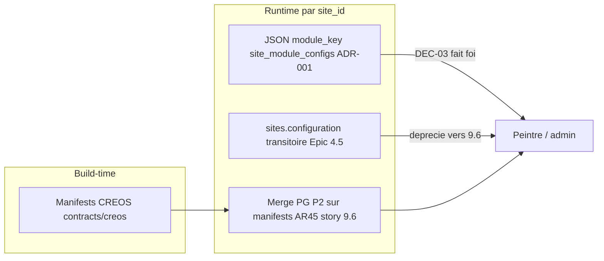

# Promotion chantier modules → PRD + architecture BMAD

## Pourquoi c’est pertinent (ta demande)

Tu as raison : aujourd’hui la **vérité opérationnelle** vit surtout dans [`references/protocole-modules-recyclique/`](references/protocole-modules-recyclique/) et les artefacts HITL, alors que [`prd.md`](_bmad-output/planning-artifacts/prd.md) garde un **§4.2 court** (6 briques) **sans** `module_key`, ADR-007, DEC-03, ni lien vers le protocole.

Un agent ou un PM qui ne lit que `_bmad-output/` peut encore croire à l’ancien modèle (TOML / fusion OpenAPI « à faire »). Ce n’est **pas** un Correct Course produit — c’est la **fermeture documentaire** du blocage archi déjà levé.

---

## État actuel (ce qui est déjà fait vs manquant)

| Artefact | Déjà intégré | Manque |
|----------|--------------|--------|
| [`architecture/index.md`](_bmad-output/planning-artifacts/architecture/index.md) | Section **Modularité v2** + lien ADR-007 **Accepted** | — |
| [`2026-05-20-adr-007-…md`](_bmad-output/planning-artifacts/architecture/2026-05-20-adr-007-reconciliation-modularite-v01-v2.md) | Miroir pack (HITL) | — |
| [`prd.md`](_bmad-output/planning-artifacts/prd.md) §4.2 | 6 briques invariantes | Addendum v2, DEC-03, `module_key`, liens pack/ADR |
| [`prd.md`](_bmad-output/planning-artifacts/prd.md) §7.1 / config admin | Capacités génériques + P2 PostgreSQL | Précision **deux couches** config (voir ci-dessous) |
| [`core-architectural-decisions.md`](_bmad-output/planning-artifacts/architecture/core-architectural-decisions.md) | P2 « config admin en PostgreSQL » | Pont explicite **ADR-001 / module-config** vs P2 merge manifests |
| [`epics.md`](_bmad-output/planning-artifacts/epics.md) | Story 9.6 existe | **Recommandé** : note 2–4 lignes Epic 9 → §4.2.1 + seed 9.6 (pas réécriture epic) |

**Ne pas** recopier les 20+ fichiers du pack dans le PRD (règle `refs_first` du pack) — **addendum distillé + pointeurs**.

---

## Nuance critique à intégrer (éviter contradiction PRD)

Le PRD dit déjà (§7, glossaire, intro) : config admin simple → **PostgreSQL P2** (surcharges sur défauts manifests).

Le chantier a ajouté une **couche explicite** :

L’addendum PRD doit **expliciter** :

- **DEC-03** : en conflit, le document JSON scopé `module_key` **gagne** sur `sites.configuration` (ne réactive pas un module off).
- **P2** reste valide pour surcharges **simple-admin** (ordre blocs, variantes) — **story 9.6** fusionne avec défauts manifests ; ce n’est pas remplacé par le JSON pilote `kpi-live-banner` seul.
- **Pas marketplace**, **pas** loader `module.toml` / `ModuleBase` en AC nominal v2 (**ADR-007**).

---

## Contenu proposé — PRD

### 1. Nouvelle sous-section après §4.2

**Titre suggéré :** `### 4.2.1 Addendum — modularité opérationnelle v2 (2026-05-20)`

**Contenu (~40–60 lignes max), sources :**

- [`07-MOD-adr`](references/protocole-modules-recyclique/07-MOD-adr-reconciliation-v01-v02.md) (résumé Accepted)
- [`06_reco HITL`](references/artefacts/2026-05-20_06_reco-hitl-post-bouclage-modules-v2.md) (DEC-03, F1 API interne, F3 1 clé = 1 package)
- [`index` pack](references/protocole-modules-recyclique/index.md) (lien recette agents **05 → 04 → 06**)

**Blocs obligatoires :**

| Bloc | Contenu |
|------|---------|
| Décisions gelées | ADR-007 Accepted ; pas marketplace ; comptage reporté |
| Identifiant | `module_key` (pattern, registre → [`05-MOD-registre`](references/protocole-modules-recyclique/05-MOD-registre-module-key.md)) |
| Contrats | OpenAPI `recyclique_moduleConfig_*` ; CREOS build-time ; standalone DEPRECATED |
| Chaîne §4.2 | Tableau 6 briques → où ça vit (contracts/, api/, peintre-nano/, story 4-x, 9.6) |
| Pilote | `kpi-live-banner` ; Epic 4 **done** ; migration toggle → 9.6 |
| Doc détaillée | **Pointeur unique** : `references/protocole-modules-recyclique/` (ne pas dupliquer) |

### 2. Patch §7.1 « Config admin simple » (~L597–608)

Ajouter un paragraphe **Clarification modularité v2** :

- renvoi §4.2.1 ;
- story BMAD **9.6** ;
- distinction config **par module_key** vs réglages **sensibles** (déjà hors périmètre simple).

### 3. Glossaire (§ près de `ModuleManifest`)

Entrée courte **`module_key`** + lien registre pack.

---

## Contenu proposé — Architecture

### Déjà OK

- ADR-007 dans index + fichier dédié — **ne pas dupliquer**, seulement vérifier hash/ statut **Accepted**.

### Patch recommandé — [`core-architectural-decisions.md`](_bmad-output/planning-artifacts/architecture/core-architectural-decisions.md)

Sous **Settings / manifests** (l.53–56), ajouter une puce :

- **Configuration par `module_key` (ADR-001, post-HITL 2026-05-20)** : préférences / activation versionnées par `site_id` + `module_key` via API `module-config` (PostgreSQL `site_module_configs`, schémas JSON dans `references/config-modules-site-id/schemas/`) ; précédence **DEC-03** ; complète P2 sans la remplacer ; détail protocole → pack MOD + ADR-007.

### Optionnel — [`guide-pilotage-v2.md`](_bmad-output/planning-artifacts/guide-pilotage-v2.md)

Une ligne dans la section jalons / doc de référence : « Modularité v2 débloquée → dev story 9.6 » + liens PRD §4.2.1 + pack.

---

## QA2 plan

| Run | Passes | Fusion | Verdict |
|-----|--------|--------|---------|
| 2026-05-21 initial | 4 passes | **88 %** | NO-GO — P0 intégrés au plan |
| **2026-05-21 re-QA2** | plan-doc + bmad-align | **92 %** | **GO** exécution |

Re-QA2 : plan-doc **93**, bmad-align **91**. P0 tous clos. P1 mineurs : todo epics optionnel ; guide-pilotage hors todos.

---

## Voie d'exécution PRD (Strophe expert)

| Voie | Quand |
|------|-------|
| **Patch chirurgical `prd.md`** (défaut) | Brief = blocs « Contenu proposé — PRD » + phrase §7.1 ci-dessous |
| **`bmad-edit-prd`** (John) | Uniquement si session discovery / menus HITL souhaitée |
| **`bmad-validate-prd`** | **Recommandé** après patch (GO documentaire auditable) |

**Interdit :** edit-prd interactif et patch automatique en parallèle sur le même fichier.

---

## Phrase modèle §7.1 (obligatoire — P0 QA2)

> La règle *pas de fichier JSON sur disque en production* (§7.1 P2) s'applique à la **config admin simple dynamique** versionnée en PostgreSQL. La couche **`module_key`** (ADR-001, table `site_module_configs`, JSON **en base**) gouverne l'activation et les préférences par module ; elle **complète** P2 et obéit à **DEC-03** en cas de conflit avec `sites.configuration`.

---

## Workflow BMAD recommandé (ordre corrigé)

| Étape | Workflow | Agent | Note |
|-------|----------|-------|------|
| 1a | Patch `prd.md` §4.2.1 + §7 + glossaire | Brief figé | **Défaut expert** |
| 1b | `bmad-edit-prd` | John (PM) | Si discovery voulue |
| 2 | Relecture | Winston | P2 / DEC-03 / ADR-007 |
| 3 | `bmad-validate-prd` | John | **Recommandé** |
| 4 | Patch `core-architectural-decisions.md` | Chirurgical | Après validation PRD |
| 5 | Sync pack + `references/index` + `ou-on-en-est` | — | Clôture |
| — | **Pas** `bmad-correct-course` massif | — | Inutile ici |

**Epics :** note 2–4 lignes en tête Epic 9 → `prd.md` §4.2.1 + `9-6-config-admin-simple-modules.md` (**recommandé**, pas optionnel faible).

**Ordre vs 9.6 :** promotion **avant ou en parallèle** de `bmad-dev-story` 9.6. Durée : **30–45 min**.

---

## Hors périmètre de cette promotion

- Recopie intégrale du pack dans `prd.md`
- Réécriture [`epics.md`](_bmad-output/planning-artifacts/epics.md) (sauf note 2 lignes en tête Epic 9 si souhaité)
- Marketplace / T-PEINT-1 / 2e module comptage
- Code Peintre (reste **dev-story 9.6**)

---

## Mise à jour pack (miroir)

Après promotion PRD :

- [`references/protocole-modules-recyclique/index.md`](references/protocole-modules-recyclique/index.md) ligne « Reste : addendum PRD §4.2 » → **Fait**
- [`09-MOD-lacunes`](references/protocole-modules-recyclique/09-MOD-lacunes-et-questions-ouvertes.md) si une ligne T-MOD promotion PRD existe

---

## Vérifications post-promotion (obligatoires)

- [ ] Grep `prd.md` : pas de `Proposed`, `fusion OpenAPI future`, `module.toml` nominal v2
- [ ] §4.2.1 présent ; liens pack + ADR-007 BMAD
- [ ] §7.1 : paragraphe modularité v2 + phrase JSON disque vs JSONB
- [ ] Glossaire `module_key`
- [ ] `core-architectural-decisions` : puce ADR-001 sans contredire P2
- [ ] Pack `index.md` : addendum PRD **Fait**
- [ ] `references/index.md` + `ou-on-en-est.md` mis à jour

## Critères de succès

- Lecteur `prd.md` seul : chaîne §4.2 + comment v2 + pointeur pack
- Aucune contradiction apparente P2 vs `module_key` / DEC-03
- `core-architectural-decisions` aligné
- Note Epic 9 dans `epics.md` (recommandé)
- Re-QA2 plan **92 % GO** (2026-05-21) — exécution autorisée
