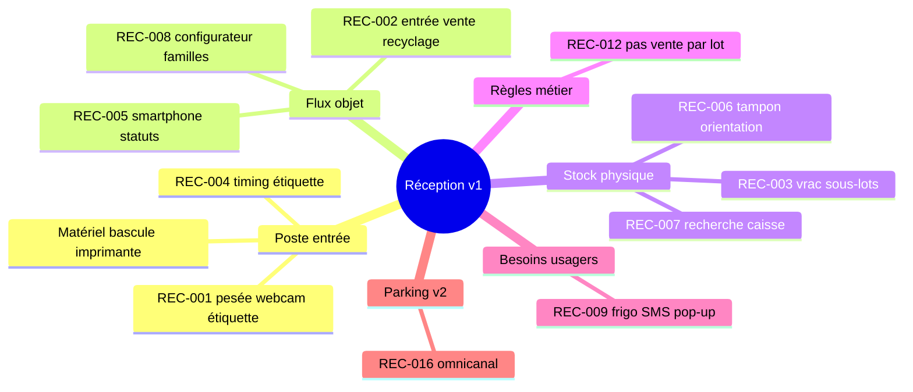
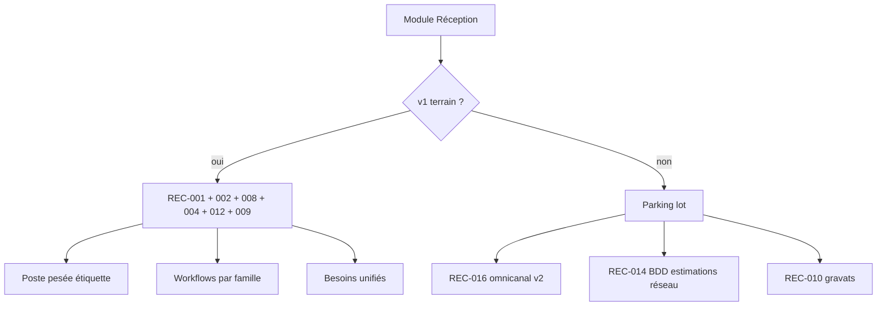
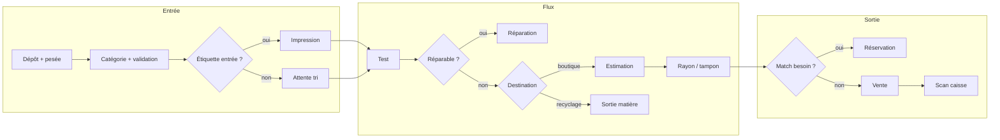
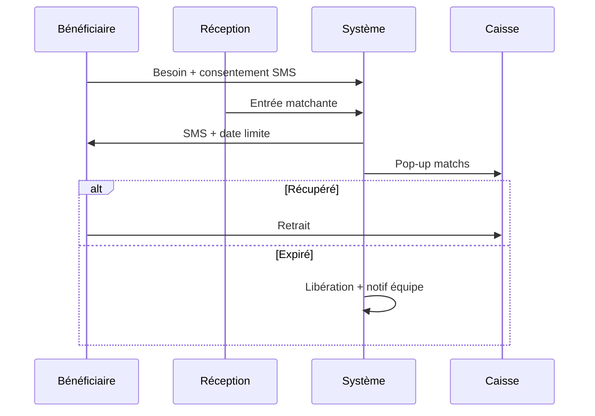
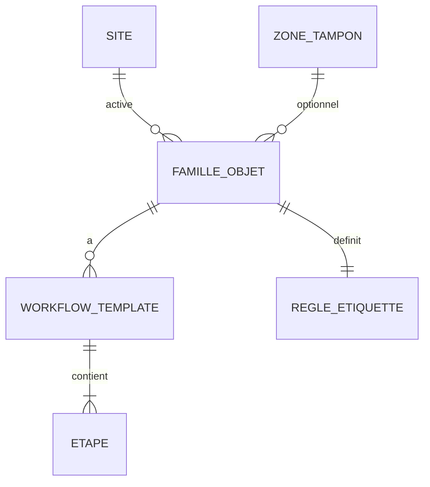

# Brainstorming Session Results

**Facilitator:** Strophe  
**Date:** 2026-05-21  
**Session:** Module Réception v1 (terrain mai 2026)

---

## Session Overview

**Topic:** Module **Réception** v1 — chaîne poste pesée → étiquette → workflows par famille d’objets → stock/tampon → besoins matériels (ex. frigo), en partant du recap terrain validé QA2.

**Goals:**

- Diverger sur les angles critiques (étiquette, postes, besoins, configurateur).
- Converger vers **parcours**, **états**, **matériel**, **config admin** exploitables pour PRD / epics / architecture.
- **Exclure v1 :** REC-016 omnicanal (parking lot v2).
- **Focus IDs :** REC-001, REC-002, REC-004, REC-008, REC-009, REC-012 (+ REC-005, REC-006, REC-007 en support).

**Approach:** Progressive Technique Flow (4 phases) — session agent-facilitée avec sources STT révisées ; convergence documentée en fin de Phase 4.

**Contrainte méthode (§0 recap) :** distinguer STT / tags éditoriaux / structuration ; *spec* terrain (ex. REC-012) à revalider sur l’audio.

---

## Input Documents

| Document | Rôle session |
|----------|----------------|
| `references/artefacts/2026-05-21_02_recap-idees-paheko-reception-terrain.md` | Source principale — §0, §3, §5, §6.1–6.2, §8 |
| `references/artefacts/archive/2026-05-21-menage-paheko-compta-qa/2026-05-21_04_revision-editoriale-transcriptions-appliquee.md` | Méthode STT (archive) |
| `references/artefacts/archive/2026-05-21-menage-paheko-compta-qa/2026-05-21_05_qa2-loop-recap-paheko-reception.md` | Gate GO brainstorm (archive) |
| `.transcription/meetings/2026-05-21-terrain-1246/working/draft/*` | Poste pesée, tampon, besoins caisse |
| `.transcription/meetings/2026-05-21-terrain-1301/working/draft/*` | Workflows, étiquette, pas de vente par lot |
| `.transcription/meetings/2026-05-21-terrain-1401/final/*` | Besoins SMS |

---

## Phase 1 — Question Storming (exploration)

*Technique : Question Storming — questions avant réponses ; cartographie des inconnues produit / terrain.*

### Questions générées (extrait — voir recap §6.1–6.2)

**Workflows et étiquettes**

- Étiqueter à l’entrée ou au tri fin — par qui, pour quelle famille ?
- Un ou deux postes physiques (réception vs estimation) ?
- Comment documenter le timing étiquette/QR **par rôle** (1er tri vs tri fin) ?
- Quelles règles métier **minimum** pour le configurateur workflows (REC-008) ?
- Que signifie « en lot étudiant ou en location » (phrase C, 1301) ?

**Besoins (pattern frigo)**

- Pop-up caisse seule, SMS seul, ou parcours unifié ?
- Que désigne l’incipit 1401 « Depuis combien de temps… » ?
- Quel consentement / RGPD pour SMS ?
- Quelles règles de priorité « qui sort en premier » ?

**Matériel et intégration**

- Bascule : protocole, fréquence de re-pesée par famille ?
- Smartphone entrepôt : offline obligatoire ou online-first v1 ?
- Que doit contenir l’étiquette minimale pour le scan caisse (poids seul vs prix) ?

**Hors périmètre v1 (noté, non résolu ici)**

- REC-016 : priorisation vente en ligne vs poste physique ?
- REC-010 gravats, REC-011 éco-organismes — ateliers ultérieurs.

---

## Phase 2 — Mind Mapping (reconnaissance de motifs)

*Technique : Mind Mapping — regroupement des idées terrain en thèmes.*

### Carte mentale — thèmes émergents

### Connexions clés (graphe recap §5 — sous-ensemble Réception)

- REC-012 → contrainte REC-003 (vrac) et lignes caisse.
- REC-008 → instancie REC-002 ; porte REC-004 par famille.
- REC-004 → conditionne REC-001 (moment impression).
- REC-001 → REC-005, REC-006, REC-009, REC-007.
- REC-016 **hors** graphe v1.

---

## Phase 3 — Morphological Analysis (développement des concepts)

*Technique : Morphological Analysis — combinaisons paramètres → solutions structurées.*

### Paramètres × options retenues

| Paramètre | Options brainstormées | Choix convergent v1 |
|-----------|----------------------|---------------------|
| Postes | 1 physique / 2 physiques / 1 logiciel 2 profils | **1 logiciel**, profils réception + estimation ; 2 postes = déploiement |
| Moment étiquette | entrée / tri_fin / deux_temps | **Par famille** (`moment_etiquette`) |
| Workflow | fixe global / par famille admin | **Template par famille** (REC-008) |
| Besoin notif | pop-up / SMS / les deux | **Parcours unifié**, canaux configurables |
| Lot commercial | autorisé / interdit | **Interdit** (REC-012 spec terrain) |
| Omnicanal | v1 / v2 | **v2 parking** (REC-016) |

### Idées développées — inventaire thématique

#### Thème A — Poste pesée → étiquette → caisse (REC-001)

1. Bascule connectée = source de vérité poids à l’entrée.
2. 1–2 webcams → photos pour caisse (REC-007).
3. Suggestion catégorie + validation humaine.
4. Module estimation optionnel (même lieu ou déporté).
5. Étiquette code-barres/QR → scan caisse remonte poids (+ prix si fixé).
6. Politique tarifaire paramétrable (ex. quart prix d’occasion, prix minimum).
7. Séparation logicielle réception / estimation sans dupliquer l’app.

#### Thème B — Workflow objet (REC-002 + REC-008)

8. Flux entrée → test → réparation ? → boutique | recyclage.
9. Prix plancher avant mise en rayon.
10. Attente / collecte / mise en rayon.
11. Ping besoin (« Christophe / aspirateur »).
12. Admin : liste ordonnée d’étapes + conditions simples (pas BPMN v1).
13. Trois familles seed : unitaire, vrac vaisselle, électroménager.
14. Priorité produit : **flux d’entrée d’abord** (oral A, pas décision formelle).

#### Thème C — Étiquette tôt/tard (REC-004)

15. Tension productivité (moins d’étiquettes) vs traçabilité.
16. Électro : une étape à l’entrée.
17. Vaisselle : deux temps ou tri fin.
18. Paramètre lié au point de pesée (entrée / magasin / sortie déchets).

#### Thème D — États et terrain mobile (REC-005)

19. Scan smartphone : « arrangé », « à réparer », « à valider ».
20. Sous-statuts horodatés sur `en_test` / `a_reparer`.
21. Spike offline vs online-first.

#### Thème E — Stock et tampon (REC-006, REC-007)

22. Zone tampon = état + emplacement + code-barres zone.
23. Scan oriente rangement (« n’importe qui avec lecteur »).
24. File estimation visible (même problème abandon que tampon).
25. Caisse : dispo + photo + allée (pattern IKEA — valider STT).

#### Thème F — Besoins / frigo (REC-009)

26. Enregistrement besoin + bénéficiaire.
27. Match à l’entrée stock.
28. Pop-up caisse + liste matchs + priorité file.
29. SMS + date limite + relances J-3/J-1.
30. Libération + notif équipe réaffectation.
31. Statut unique `reserve_besoin` pour les deux canaux.

#### Thème G — Règles et lots (REC-012, REC-003)

32. Jamais de vente par lot commercial.
33. Lot logistique vrac → sous-lots homogènes → une étiquette par sous-lot.
34. Caisse : une ligne par sous-lot.

#### Thème H — Parking v2 (REC-016)

35. Vente en ligne / plateformes / pilotage en direct — intuition A, phrase incomplète.
36. Prévoir `objet_id` + photos stables sans connecteurs marketplace v1.

---

## Phase 4 — Decision Tree Mapping (arbitrages et plans)

*Technique : Decision Tree Mapping — chemins de décision v1 vs différé.*

### Arbre de périmètre v1

### Décisions de session (convergence)

| # | Décision | Rationale |
|---|----------|-----------|
| D1 | REC-016 → **v2 uniquement** | Intuition ; ne bloque pas pesée / étiquette / workflows |
| D2 | Parcours besoin **unifié** (SMS + pop-up) | Même réservation, canaux configurables |
| D3 | `moment_etiquette` **par famille** | Résout tension REC-004 sans règle globale |
| D4 | Configurateur v1 = **liste d’étapes** + 2 transitions conditionnelles | REC-008 « intuition à affiner » — éviter sur-ingénierie |
| D5 | REC-012 appliqué **globalement** | Spec terrain — valider audio |
| D6 | Réception **ne ventile pas Paheko** | Frontière PKO-001 ; données structurées vers caisse |

### Questions laissées ouvertes (atelier terrain)

| ID | Question | Porteur |
|----|----------|---------|
| Q1 | Étiquette entrée vs tri fin — défauts par famille | Terrain + produit |
| Q2 | 1 vs 2 postes physiques | Terrain |
| Q3 | RGPD / opt-in SMS | Juridique |
| Q4 | Priorité file besoins | Terrain |
| Q5 | Offline smartphone | Tech spike |
| Q6 | « Lot étudiant / location » (1301) | Terrain |

---

## Idea Organization and Prioritization

### Thematic organization (récapitulatif)

| Thème | Idées clés | Priorité session |
|-------|------------|------------------|
| Poste entrée | 1–7 | **P0** |
| Flux + config | 8–14 | **P0** |
| Étiquette | 15–18 | **P0** |
| Mobile / états | 19–21 | **P1** |
| Stock / caisse | 22–25 | **P1** |
| Besoins | 26–31 | **P0** |
| Lots | 32–34 | **P0** (contrainte) |
| Omnicanal | 35–36 | **P2 parking** |

### Top priority ideas (action v1)

1. **Chaîne pesée → étiquette → scan caisse** (REC-001) — backbone module.
2. **Machine à états + templates par famille** (REC-002 + REC-008).
3. **Règle pas de vente par lot** (REC-012) — contrainte caisse.
4. **Parcours besoin unifié** (REC-009) — pattern frigo extensible.
5. **Paramètre étiquette par famille** (REC-004).

### Quick wins

- Profils logiciels réception / estimation sur un seul déploiement.
- Trois familles seed préconfigurées.
- États smartphone comme sous-statuts (sans refonte complète).

### Breakthrough / différé

- REC-016 omnicanal + REC-014 mutualisation réseau.
- Éditeur graphique workflows (post-v1).

---

## Livrables convergents — spécification produit (Phase 3–4)

*Les sections suivantes formalisent les idées priorisées — matière PRD / epics, non spec figée.*

### Parcours utilisateurs v1

#### Parcours nominal — objet unitaire

**Étapes :** réception + test → branche réparation (REC-005) → boutique (estimation, prix plancher) ou recyclage → attente/tampon (REC-006) → matching besoin (REC-009) → scan caisse.

#### Parcours vrac vaisselle (REC-003 + REC-012)

1. Peser carton → fiche lot logistique (non vendable).
2. Tri : scan → sous-lots homogènes → une fiche/étiquette chacun + photo.
3. Caisse : une ligne par sous-lot.

#### Parcours besoin — pattern frigo (REC-009)

**Champs minimaux :** `besoin_id`, catégorie, bénéficiaire, `canal_notif`, `date_limite`, `statut_reservation`, priorité.

### Machine à états — objet

| Code | Libellé | Notes |
|------|---------|-------|
| `brouillon` | Fiche en cours | |
| `identifie` | Catégorie validée | |
| `en_test` | Test qualité | + sous-statuts REC-005 |
| `a_reparer` | Réparation | |
| `en_estimation` | File estimation | |
| `tampon` | Zone tampon REC-006 | |
| `pret_vente` | Prêt rayon | |
| `en_rayon` | Disponible caisse | |
| `reserve_besoin` | Réservé REC-009 | |
| `sorti_matiere` | Recyclage | |
| `vendu` | Vendu | |
| `libere` | Besoin expiré | → `en_rayon` |

**Sous-statuts smartphone (REC-005) :** `a_valider`, `a_reparer`, `arrange`, `a_finir`.

**`moment_etiquette` (REC-004) :** `entree` | `tri_fin` | `deux_temps` | `scotch_manuel` (transition).

### Matériel et rôles

| Rôle | Matériel | Actions v1 |
|------|----------|------------|
| Réception | PC + bascule + webcam(s) + imprimante | Pesée, catégorie, photo, étiquette selon famille |
| Estimation | Même ou 2e poste | Prix plancher, politique site |
| Tri / atelier | Smartphone + lecteur | REC-005, vrac, orientation tampon |
| Caisse | Scan + TPE | Scan étiquette, pop-up besoins, recherche stock |
| Admin | Navigateur | Familles, workflows, étiquette, zones, besoins |

| Équipement | Fonction |
|------------|----------|
| Bascule connectée | Poids entrant / re-pesées règle famille |
| Webcam(s) | Photos entrée (REC-007) |
| Imprimante étiquettes | Code-barres / QR |
| Lecteurs code-barres | Poste, entrepôt, caisse — même `objet_id` |
| Smartphone | États transitoires, tri |
| Lecteur caisse | Encaissement ; contrat scan → ligne + poids |

### Configurateur admin (REC-008)

| Entité admin | Attributs clés |
|--------------|----------------|
| Famille d’objet | code, libellé, actif |
| Workflow template | étapes ordonnées, transitions (`si_reparation`, `si_match_besoin`) |
| Règle étiquette | `moment_etiquette`, `point_pesee` |
| Politique tarif | `prix_minimum` \| `prix_fixe` \| `quart_occasion` |
| Zone tampon | code-barres, libellé, familles |
| Type besoin | catégorie, délai, modèle SMS |
| Poste | `reception` \| `estimation`, ids matériel |

**Règles métier minimum v1 :** workflow défaut par famille ; 3 familles seed ; `lot_commercial_interdit` global ; pas d’éditeur graphique.

### Contrat caisse (frontière PKO)

| Donnée fiche/étiquette | Scan caisse |
|------------------------|-------------|
| `objet_id` | Ligne ticket |
| `poids_kg` | Remontée auto |
| `prix` | Ligne ou prix libre |
| Match besoin | Pop-up REC-009 |
| Don -18 | PKO-016 (module caisse) |

### Parking lot v2 — REC-016

| Champ | Valeur |
|-------|--------|
| ID | REC-016 |
| Sources | 1246 IDEA-009 |
| Énoncé | Vente en ligne, plateformes, pilotage en direct |
| Garde-fou v1 | Pas de story marketplace ; `objet_id` + photos prêts export futur |

---

## Action Planning

### Idea 1 : Chaîne pesée → étiquette → caisse (P0)

**Why this matters :** Backbone REC-001 ; alimente caisse, poids, photos.

**Next steps :**

1. Spécifier contrat API bascule + format étiquette.
2. Prototyper écran poste réception (pesée + validation catégorie).
3. Définir payload scan caisse (poids, prix optionnel).

**Resources :** matériel terrain, PRD caisse existant.  
**Success indicators :** scan caisse remonte poids sans ressaisie.

### Idea 2 : Workflows par famille (P0)

**Next steps :**

1. Modèle données `WorkflowTemplate` + `FamilleObjet`.
2. Seed 3 familles (unitaire, vrac, électro).
3. Mapper états noyau ↔ étapes template.

### Idea 3 : Besoins unifiés (P0)

**Next steps :**

1. Fiche besoin + statut `reserve_besoin`.
2. Intégration SMS (spike RGPD).
3. Pop-up caisse sur match entrée.

### Idea 4 : Atelier terrain Q1–Q4

**Next steps :** trancher étiquette par famille, postes physiques, priorité besoins ; renommer speakers STT.

---

## Clôture de session — synthèse exploitable

### Statut global

- **Phase 1** Question Storming : close (questions §6.1–6.2 cartographiées).
- **Phase 2** Mind Mapping : close (7 thèmes + graphe dépendances).
- **Phase 3** Morphological Analysis : close (48 idées, livrables parcours/états/matériel/config).
- **Phase 4** Decision Tree Mapping : close (REC-016 parking v2 ; 6 décisions D1–D6).

### Sortie utile pour la suite BMAD

- Entrée **PRD module Réception** ou **epics** (réception flow dans planning v2).
- Atelier terrain pour Q1–Q6 avant gel spec.
- **Ne pas** confondre avec `references/artefacts/` — cette session est la **source BMAD** ; le recap `02` reste l’inventaire idées terrain.

### Mapping REC → sources (§8 recap)

| ID recap | Meeting | IDEA pipeline |
|----------|---------|---------------|
| REC-001, 005, 006, 007, 009 | 1246 | 001, 003, 004, 005, 007 |
| REC-002, 004, 008, 012 | 1301 | 005, 004, 008, 002 |
| REC-009 SMS | 1401 | 001 |
| REC-016 | 1246 | 009 → parking v2 |

---

*Session BMAD — module Réception v1. Valider sur l’audio les lignes spec terrain (REC-012) avant gel implementation.*
