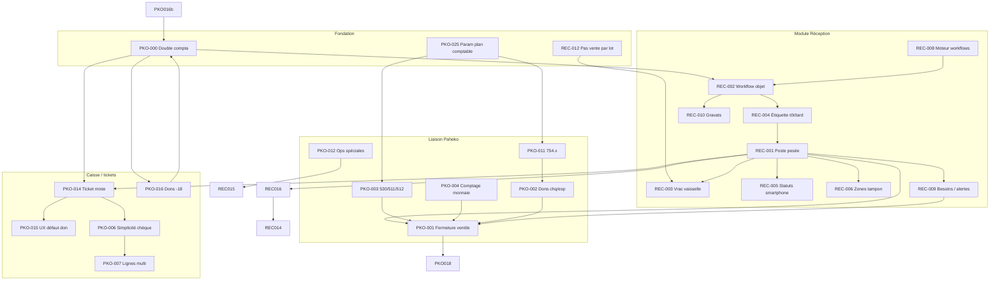

# Recap exhaustif — idées terrain pour modules **Réception** et **Liaison Paheko**

**Date :** 2026-05-21  
**Dernière alignement sources :** 2026-05-21 (révision éditoriale appliquée sur les **6** meetings ; finaux régénérés).  
**Sources de vérité :** pour chaque meeting, les **cinq** fichiers `working/draft/*.md` + `final/<MEETING_ID>.md` sous `.transcription/meetings/` — voir [.transcription/README.md](../../.transcription/README.md).  
**Volume indexé :** **49** idées pipeline (18–21 mai, **48** in-scope + **1245** Peintre hors périmètre) ; **42** cartes REC·PKO. **Addendum 23/05 :** **+24** idées — voir [2026-05-23_01_addendum-transcripts-1423-visions-rec-pko.md](2026-05-23_01_addendum-transcripts-1423-visions-rec-pko.md) (**ORG/WFL/VIS**, upgrades **REC-008**, **REC-001**).  
**Objectif :** matière pour brainstorm affichages, backend, accessoires — **pas** une spec figée.  
**Périmètre :** parcours objet (entrée → workflows → étiquettes → caisse) et chaîne caisse → Paheko (fermeture, plan comptable, tags).  
**Hors périmètre direct :** liaison agentique Peintre seule (`2026-05-18`) ; notes de frais bénévoles (PKO-023, chantier adjacent).

**Documents projet à croiser :** [PRD caisse-compta Paheko](../migration-paheko/2026-04-15_prd-recyclique-caisse-compta-paheko.md), [paramétrage SuperAdmin](../migration-paheko/2026-04-18_spec-corrections-qa-parametrage-comptable-superadmin.md), audits `references/migration-paheko/audits/`.  
**Transcription — QA2 :** rapports `qa2-draft-fusion.md` présents pour **4/6** meetings ; **absents** pour `2026-05-21-terrain-1401` et `2026-05-21-recyclique-terrain-paheko` ; **aucun** `qa2-final-fusion.md` sur disque (optionnel si re-score formel).

---

## 0. Lecture des sources révisées (obligatoire avant brainstorm)

| Signal | Signification pour ce recap |
|--------|----------------------------|
| Encadré **Source et méthode** en tête des drafts | Distinction **STT** / **tags éditoriaux** (*Nature*, *Modules*, *Maturité*) / **verbatim** (citations) vs **structuration** (listes numérotées, mécanismes détaillés non lus mot pour mot). |
| *hypothèse*, *réserve QA*, *image métier* | Ne pas traiter comme décision terrain sans relecture audio. |
| **IDEA-009** (1246) | Ajout post-QA2 : omnicanal / vente en ligne — absent de la première version de ce recap. |
| **IDEA-008** (1301) | Maturité abaissée en **intuition à affiner** (ton « idéal cible » oral). |
| **IDEA-004 / 005** (1333) | **Ne pas fusionner** : -18 = règles de **lignes ticket** (004) vs **kg matière / traces compta** (005). |
| **IDEA-002** (1333) | *Agent* = composant logiciel ou règle auto (pas « agent IA » sans preuve audio). |
| Paheko | Volume élevé ; fiches = agrégats contigus ; valider décisions sur l’audio. |
| **1401** | Final peut afficher durée **0m** (JSON ~38 s) ; Q « Depuis combien de temps… » = **ouverture** audio, pas fin — voir `qa2-*-fusion.md` 1401. |
| **23/05/2026** | Addendum **1423** (workflows org) + **visions** (VIS-001…020) — hors corps REC/PKO ; voir artefact `2026-05-23_01_*`. |

Les IDs **REC-*** / **PKO-*** de ce document restent stables pour le brainstorm ; la colonne **IDEA pipeline** pointe vers les fiches à jour sur disque.

---

## 1. Intervenants (diarisation AssemblyAI — à valider)

Les meetings utilisent **A / B / C / D**. Hypothèses déduites du contenu (noms cités dans l’audio) :

| Label | Rôle probable | Indices dans l’audio | Réunions |
|-------|---------------|----------------------|----------|
| **A** | Porteur produit / démo Recyclique (recherches, « premier jet », lecture config) | « mes recherches », « Recyclic », « décision métier retenu », démo écrans | Paheko, 1246, 1301, 1333, 1401 |
| **B** | Comptabilité / Paheko terrain | Explique écritures banque, 530/511/512, « on ne peut pas transiger » ; **Carole** citée pour montrer Paheko | Paheko, 1246, 1301, 1333 |
| **C** | Direction / terrain opérationnel | Refus 707 générique, **Gabi**, **Hélène**, plafonds frais ; navigue Paheko ; **Christelle** citée **Paheko seulement** (pas dans transcripts 1246/1301) | Paheko, 1246, 1301 |
| **C** (1246) | Équipe **caisse** | « à la caisse, on vient demander si on a un produit » | 1246 |
| **B** (1246, 1301) | Logistique / stock / tri | Zones tampon, estimation papier, « on ne vend pas par lot » | 1246, 1301 |

**À faire :** renommer dans `transcription-profile.json` après validation terrain (sinon toute attribution « qui décide » reste **provisoire**).

**Lecture « qui dit / qui décide » :**

- **Propose / construit** : surtout **A** (vision produit, modules, automatisations).
- **Contraindroit comptable** : **B** (écritures, lettrage, fin d’année, non-négociable).
- **Arbitre métier terrain** : **C** (comptes vente réemploi, politique prix, équité bénévoles).
- **Décision explicite en séance** : voir colonne *Statut* par idée (spec / décision / ouvert).

---

## 2. Principe structurant (les deux modules)

### PKO-000 — Double compta matière + financière (spec)

| Champ | Valeur |
|-------|--------|
| **Sources** | Paheko IDEA-018 ; 1333 IDEA-004 + **IDEA-005** (problèmes **distincts** après révision) |
| **Qui dit** | **A** synthétise (Paheko) ; **B/A** sur -18 (1333) |
| **Statut** | **Specification** produit (cadre) ; détail **005** = idée détaillée + réserve compta |
| **Énoncé** | Recyclique trace **objets**, **tickets**, **gratuités** ; Paheko = **flux € réels**. Sortie -18 : **pas de flux monétaire** vers Paheko pour la matière (kg) — **≠** absence de toute trace comptable (1333 : **A** dit « don Paeco », **B** conteste — tension **A/B**, trace « don » à **nuancer** avec EC, voir PKO-016b). |
| **Exemple** | Ticket mixte habits -18 (don) + vaisselle payante : lignes stables (PKO-016) ; Paheko encaisse la partie payante. |
| **Dépendances** | Conditionne tous les mappings PKO-* et REC-*. |
| **Questions** | Écriture / trace Paheko pour sorties matière sans € (1333 IDEA-005) — **expert-comptable**. |

---

## 3. Module **Réception** (workflows, étiquettes, stock, besoins)

### REC-001 — Poste réception idéal (pesée → étiquette → caisse)

| Champ | Valeur |
|-------|--------|
| **Sources** | 1246 IDEA-001 |
| **Qui propose** | **A** (monologue vision) |
| **Qui valide** | **B/C** complètent (zones, caisse) — pas de veto |
| **Statut** | Idée détaillée — **backbone** du module |
| **Mécanisme** | Bascule connectée, 1–2 webcams → pesée → suggestion catégorie + validation → estimation optionnelle → étiquette code-barre/QR → scan caisse remonte **poids** (+ prix si fixé). |
| **Exemples** | Politique tarif : « quart du prix d’occasion » ; prix minimum ici vs prix fixe ailleurs ; jeux/cassettes → zone estimation papier (B). |
| **Dépend de** | REC-004 (étiquette), REC-008 (workflow), paramètres politique tarifaire par site |
| **Active** | REC-005, REC-006, REC-007, REC-009, REC-016 |
| **Accessoires** | Bascule, webcam(s), imprimante étiquettes, lecteur CB/QR |
| **Questions** | Séparer 1 ou 2 postes (réception vs estimation) ? Voir **REC-016** (omnicanal, phrase incomplète en fin de bande). |

### REC-002 — Workflow objet générique (entrée → vente ou recyclage)

| Champ | Valeur |
|-------|--------|
| **Sources** | 1301 IDEA-005 |
| **Qui propose** | **A** |
| **Statut** | Idée détaillée — **priorité terrain** : « flux d’entrée d’abord » (ne pas confondre maturité avec REC-008) |
| **Tags draft** | *flux, paramétrage* (révision 1301) |
| **Étapes** | Entrée → test → (réparer ou non) → branche boutique vs autre → prix plancher → attente/collecte/mise en rayon → annonces / matching besoin → remontée caisse. |
| **Exemple** | « Appelez Christophe, aspirateur rentré » (ping besoin). |
| **Dépend de** | REC-008 (moteur configurable), REC-003 (étiquetage selon étape) — **co-conception** avec REC-008 (lien réciproque : moteur paramètre le flux) |
| **Active** | REC-010 (zones physiques), REC-007, REC-011 |
| **Questions** | Ordre exact des statuts par famille d’objet (à paramétrer). |

### REC-003 — Vrac vaisselle : lot logistique → sous-lots homogènes

| Champ | Valeur |
|-------|--------|
| **Sources** | 1301 IDEA-001 |
| **Qui propose** | **A** |
| **Statut** | Idée détaillée — **cas d’école** |
| **Exemple** | Carton code 10 « vrac vaisselle à trier » → scan → fractions (6 assiettes, 5 verres) → **une fiche par sous-lot** + photo. |
| **Dépend de** | REC-004, REC-012 (pas de vente par lot) |
| **Active** | REC-006 (gravats), pesée différentielle |

### REC-004 — Arbitrage étiquette tôt vs tard

| Champ | Valeur |
|-------|--------|
| **Sources** | 1301 IDEA-004 |
| **Qui propose** | **C** (question) ; **A** arbitre « ça dépend » |
| **Statut** | **Ouvert** |
| **Tension** | Moins d’étiquettes (étiqueter au tri fin par cercle) vs traçabilité (étiqueter à l’entrée). |
| **Exemples** | Électroménager : une étape ; vaisselle : deux temps possible ; aujourd’hui parfois scotch (B). |
| **Dépend de** | Point de pesée (entrée vs magasin vs sortie déchets) |
| **Questions** | Règle par **famille d’objet** dans REC-008. |

### REC-005 — États transitoires terrain (smartphone)

| Champ | Valeur |
|-------|--------|
| **Sources** | 1246 IDEA-003 |
| **Qui propose** | **A** |
| **Statut** | Idée détaillée |
| **Exemples** | « C’est arrangé », « il faut réparer », « à valider » — scan code-barre en entrepôt. |
| **Dépend de** | REC-001, REC-002 |
| **Backend** | Machine à états par objet, synchronisation offline ? |

### REC-006 — Zones tampon + orientation physique

| Champ | Valeur |
|-------|--------|
| **Sources** | 1246 IDEA-004 |
| **Qui propose** | **B**, confirmé **A** |
| **Statut** | Idée détaillée |
| **Exemple** | Zone entre mono et extérieur ; objets posés mais pas rangés ; code-barre → destination lecteur (*hypothèse* « bénévole » — audio : « n’importe qui »). |
| **Lien** | Parallèle file d’attente **estimation** (même problème d’abandon si pas visible). |

### REC-007 — Recherche stock depuis caisse (photo + emplacement)

| Champ | Valeur |
|-------|--------|
| **Sources** | 1246 IDEA-005 |
| **Qui propose** | **B/C** ; **A** structure |
| **Statut** | Pattern UX — formulation « téléphone / étage » = **image métier** (révision) ; valider STT |
| **Exemple** | Client demande produit → caisse voit dispo + photo + allée (IKEA). |
| **Dépend de** | Photos à l’entrée (REC-001), données emplacement |

### REC-008 — Moteur workflows admin par famille d’objets

| Champ | Valeur |
|-------|--------|
| **Sources** | 1301 IDEA-008 ; **addendum 23/05** : 1423 IDEA-001–003, visions **VIS-010**, **VIS-019** |
| **Qui propose** | **A** |
| **Statut** | **Intuition à affiner** (révision) — cœur configurateur visé, mais **réserve QA** : ton oral « idéal cible » ; ne pas sur-classer en spec avant cadrage règles |
| **Tags draft** | *flux, paramétrage* — pas le mot « orchestration » à l’oral |
| **Énoncé** | Chaque ressourcerie « fait sa sauce » → admin définit étapes + conditions (si réparation → étape X). |
| **Dépend de** | REC-002 |
| **Questions** | « En lot étudiant ou en location ? » (C, phrase isolée) — **à clarifier**. |

### REC-009 — Alertes besoin / matching (ex. frigo — un cas parmi d’autres)

| Champ | Valeur |
|-------|--------|
| **Sources** | 1246 IDEA-007 ; 1401 IDEA-001 ; Paheko IDEA-020 (*alertes à la **réception***) |
| **Qui propose** | **A** (1246, Paheko) ; **1401** = reprise / synthèse voix tierce (« ce qu’elle disait ») — à valider audio ; priorité file **B** (1246) |
| **Statut** | Idée détaillée — **fil rouge** |
| **Variantes** | (a) Pop-up **caisse** + priorité « qui sort en premier » (1246) ; (b) **SMS** + date limite + relances + réaffectation (1401). |
| **Lecture révisée** | Angle **social / bénéficiaires enregistrés**, pas seulement « réappro magasin » (vues 1246). |
| **Exemple** | Besoin « petit frigo » → entrée stock → contact SMS, garde jusqu’à date, sinon remis en circuit + notif équipe. |
| **Dépend de** | Fiche besoin + consentement contact ; matching objet/catégorie ; identification à l’entrée (Paheko IDEA-020) |
| **Questions** | RGPD SMS ; fusionner pop-up caisse et SMS en un seul parcours ? |

### REC-010 — Gravats : pesée sortie vs déduction entrée − magasin

| Champ | Valeur |
|-------|--------|
| **Sources** | 1301 IDEA-006, IDEA-007 |
| **Qui propose** | **C** constate angle mort ; **A** propose déduction |
| **Statut** | **Ouvert** (choix comptable + opérationnel) |
| **Exemple** | 18 kg entrée, 12 kg magasin → 6 kg imputés gravats sans peser déchets intermédiaires. |
| **Dépend de** | Points de pesée REC-004 |
| **Lien Paheko** | Agrégats matière pour déclarations (REC-011) |

### REC-011 — Déclarations éco-organismes (ASL cycle, etc.)

| Champ | Valeur |
|-------|--------|
| **Sources** | 1301 IDEA-003 ; Paheko IDEA-019 |
| **Qui propose** | **B/A** digression ; **A** ambition API |
| **Statut** | Recherche / long terme |
| **Exemple** | Évolution formulaire (vélo, fer, plastique) — « plus de rétrib au vélo ». |
| **Questions** | Lignes agrégées attendues janvier ; priorité API Eco Maison vs export manuel. |

### REC-012 — Règle : on ne vend jamais par lot

| Champ | Valeur |
|-------|--------|
| **Sources** | 1301 IDEA-002 |
| **Qui dit** | **B** ; confirmé **A** |
| **Statut** | **Specification** |
| **Impact** | Lots = logistique interne uniquement ; ticket caisse = lignes unitaires. |

### REC-013 — Photo « produit monté » (gros volumes)

| Champ | Valeur |
|-------|--------|
| **Sources** | 1246 IDEA-006 |
| **Qui propose** | **B/A** |
| **Statut** | Pattern UX |
| **Exemple** | Lits : monter pour photo, démonter en stock. |

### REC-014 — Base estimations mutualisée (réseau)

| Champ | Valeur |
|-------|--------|
| **Sources** | 1246 IDEA-002 |
| **Qui propose** | **A** |
| **Statut** | Intuition — « plus tard » |
| **Hors v1** | Possible module écosystème |
| **Lien** | REC-016 (données de référence en ligne) |

### REC-015 — Retours : traçabilité donné / acheté

| Champ | Valeur |
|-------|--------|
| **Sources** | 1246 IDEA-008 ; Paheko IDEA-017 |
| **Qui propose** | **B** (1246) ; discussion SAV Paheko |
| **Statut** | Ouvert |
| **Exemple** | Retour après achat : rapprochement **heure d’achat** (1246) ; exemple **télé défectueuse** = **Paheko** SAV (pas dans JSON 1246). |
| **Dépend de** | Ticket + horodatage ; politique remboursement PKO-017 |
| **Lien Paheko** | Opérations spéciales remboursement |

### REC-016 — Omnicanal : vente en ligne, plateformes, pilotage en direct

| Champ | Valeur |
|-------|--------|
| **Sources** | 1246 IDEA-009 (**ajout révision post-QA2**) |
| **Qui propose** | **A** (monologue poste idéal) |
| **Statut** | **Intuition** — priorisation produit **à trancher** |
| **Énoncé** | Relie la chaîne entrée–caisse à vente en ligne / gestion en direct sur plateformes. |
| **Citations source** | *« basculer directement sur les plateformes de vente en ligne… gestion-là en direct »* (`1246/transcriptions/21-05-2026_1246.json`, utterance ~481). |
| **Dépend de** | REC-001 |
| **Active** | REC-014 (mutualisation), évolutions caisse / catalogue |
| **Questions** | Suite immédiate après « vente en ligne en direct » dans la roadmap ? — 1246 Q2 consolidée |

---

## 4. Module **Liaison Paheko** (caisse, clôture, plan comptable, ventilation)

### PKO-001 — Fermeture caisse → ventilation automatique Paheko

| Champ | Valeur |
|-------|--------|
| **Sources** | Paheko IDEA-001 |
| **Qui propose** | **A** ; **B** valide complexité + montre écritures réelles |
| **Statut** | Objectif central liaison |
| **Exemple** | « Quand tu fermes ta caisse, ça ventile automatiquement dans Paheko » |
| **Dépend de** | PKO-003, PKO-004, paramétrage comptes, REC-001 (données ticket) |
| **Active** | PKO-018 (cockpit import CSV), PKO-016 (lignes ticket -18), rapprochement banque |

### PKO-002 — Distinguer dons chèque vs dons espèces (transitoire caisse-banque)

| Champ | Valeur |
|-------|--------|
| **Sources** | Paheko IDEA-002 |
| **Qui demande** | **B** |
| **Qui confirme** | **A/C** — compte transitoire existe |
| **Statut** | Idée détaillée — **contrainte** |
| **Pourquoi** | Remises banque + pointage fin de mois / fin d’année |
| **Lien** | PKO-011 (754.x), plusieurs 512 si besoin (B segment 001) |

### PKO-003 — Modèle 530 / 511 / 512 (tampon, billets, pièces)

| Champ | Valeur |
|-------|--------|
| **Sources** | Paheko IDEA-003, segments 001, 010 |
| **Qui explique** | **B** (écritures) ; **A** schématise T compte |
| **Statut** | Pédagogie + cible mapping |
| **Exemple** | Totaux ventes/dons espèces et chèques ; 511 205 billets, 512 210 pièces ; 530 delta + fond de caisse |
| **Questions** | 511 vs 512 selon écritures Paheko existantes — aligner sur **extrait Carole** |

### PKO-004 — Comptage pièces et billets à la clôture (remplace Excel)

| Champ | Valeur |
|-------|--------|
| **Sources** | Paheko IDEA-004 |
| **Qui propose** | **A** (constat terrain hier) |
| **Qui nuance** | **B** — comptage souvent indispensable si forte activité espèces |
| **Statut** | Idée détaillée |
| **UX** | Module intégré clôture ; optionnel paramétrable par site |

### PKO-005 — Cockpit Recyclique : limiter navigation Paheko quotidienne

| Champ | Valeur |
|-------|--------|
| **Sources** | Paheko IDEA-005 |
| **Qui propose** | **A** |
| **Statut** | Stratégie |
| **Énoncé** | Saisie métier (km, photo facture, réservations…) côté Recyclique ; Paheko = sortie comptable + rapprochements |
| **Ne supprime pas** | PKO-024 (mises à jour Paheko, sauvegarde SQL) |

### PKO-006 — Règle simplicité : pas de prorata physique chèque don/vente

| Champ | Valeur |
|-------|--------|
| **Sources** | Paheko IDEA-006 |
| **Qui décide** | **Accord oral séance** : **B** pose la règle anti-prorata, **A** confirme (*« On va rester simple »*) — à formaliser EC |
| **Statut** | **Décision** — specification (accord oral, pas arbitrage unilatéral A) |
| **Citation** | « On va rester simple » — pas « une proportion du chèque sur les dons » |
| **Active** | PKO-007 |

### PKO-007 — Un chèque, plusieurs lignes comptables

| Champ | Valeur |
|-------|--------|
| **Sources** | Paheko IDEA-007 |
| **Statut** | Idée détaillée — cohérent PKO-006 |
| **Exemple** | Ligne don chèque 5 € + ligne encaissement vente 15 € pour contrôle |

### PKO-008 — Fond de caisse, clôture décalée, écarts

| Champ | Valeur |
|-------|--------|
| **Sources** | Paheko IDEA-008 |
| **Statut** | Risque documenté |
| **Exemple** | Caisse non fermée → lendemain repart sur fond de caisse veille ; corrections manuelles BDD |
| **Dépend de** | PKO-004 (comptage réel comme garde-fou) |

### PKO-009 — Encaissement dons sans ligne produit (atelier)

| Champ | Valeur |
|-------|--------|
| **Sources** | Paheko IDEA-009 |
| **Statut** | Lacune actuelle |
| **Exemple** | Atelier cartes 69 € — aujourd’hui obligé de passer par « petit produit » |
| **Questions** | Lien analytique projet (754.111) sans ticket article |

### PKO-010 — Compte vente réemploi (7070) vs 707 générique

| Champ | Valeur |
|-------|--------|
| **Sources** | Paheko IDEA-010 |
| **Qui refuse 707** | **C** |
| **Qui retient 7070** | **A** (« décision métier retenu ») |
| **Statut** | Intuition → **à valider EC** + paramétrage SuperAdmin |
| **Dépend de** | PKO-022 (migrations) |

### PKO-011 — Plan dons manuels 754.x (espèces, chèques, projets)

| Champ | Valeur |
|-------|--------|
| **Sources** | Paheko IDEA-011 |
| **Qui navigue** | **B/C** dans Paheko |
| **Statut** | Idée détaillée |
| **Exemple** | 754.11 central ; sous-comptes dont 754.115 chèques ; affectation projet atelier cartes |

### PKO-012 — Opérations spéciales (annulation, remboursement, exercice clos)

| Champ | Valeur |
|-------|--------|
| **Sources** | Paheko IDEA-012 |
| **Statut** | Idée détaillée — croiser `references/operations-speciales-recyclique/` |
| **Exemple** | 2 types remboursement : exercice courant vs antérieur clos |

### PKO-013 — Décaissements : 471 vs 53 vs 58

| Champ | Valeur |
|-------|--------|
| **Sources** | Paheko IDEA-013 |
| **Qui débat** | **A/B** (+ comptable invité) |
| **Statut** | **Question ouverte** — piste en séance, **validation EC requise** |
| **Hypothèse de travail (audio)** | 58 = virements internes trésorerie ; 53 = espèces caisse ; 471 = vrais cas d’attente — **validation EC requise** |

### PKO-014 — Tickets mixtes : lignes don vs payantes

| Champ | Valeur |
|-------|--------|
| **Sources** | 1333 IDEA-001 ; Paheko (cohérent PKO-006/007) |
| **Qui décrit** | **B** (1333) |
| **Statut** | Idée détaillée |
| **Exemple** | Habits enfant don + vaisselle payante sur même ticket |

### PKO-015 — UX moyen de paiement : défaut « don » gênant

| Champ | Valeur |
|-------|--------|
| **Sources** | 1333 IDEA-002, IDEA-003 |
| **Qui subit** | **A** confirme friction ; **B** relie à nouvelle version caisse |
| **Statut** | Bug / UX — correctif attendu |
| **Glossaire** | « excès de zèle d’un **agent** » = composant logiciel / règle auto (**pas** agent IA sans preuve audio) |
| **Tags draft** | IDEA-003 : *release, caisse* |
| **Règle** | Ne pas contredire PKO-016 / PKO-016b |

### PKO-016 — Dons -18 : nature de **ligne ticket** indépendante du moyen de paiement

| Champ | Valeur |
|-------|--------|
| **Sources** | 1333 **IDEA-004** (scission révision — ne pas fusionner avec 005) |
| **Statut** | **Specification** |
| **Lien** | PKO-014 (ticket mixte) |

### PKO-016b — Sortie -18 : compta **matière (kg)** vs traces Paheko

| Champ | Valeur |
|-------|--------|
| **Sources** | 1333 **IDEA-005** |
| **Qui** | **B** étonné ; **A** : « ce ne sont pas des sous, c’est la sortie matière » |
| **Statut** | Idée détaillée + **réserve** : distinguer absence de flux € vs besoin de **trace** don (PaEco/Paheko dans STT) |
| **Lien** | PKO-000 |
| **Questions** | Écriture Paheko exacte — EC |

### PKO-017 — Politique remboursement (prix payé vs donné)

| Champ | Valeur |
|-------|--------|
| **Sources** | Paheko IDEA-017 ; REC-015 |
| **Statut** | **Ouvert** — politique locale |
| **Besoin** | Ticket + étiquette + horodatage pour reconstituer |

### PKO-018 — Cockpit : import CSV banque, alertes prélèvements

| Champ | Valeur |
|-------|--------|
| **Sources** | Paheko IDEA-016 |
| **Statut** | Idée détaillée |
| **Exemple** | Rapprochement auto ; rappel « prélèvement Enercop devait passer hier » |

### PKO-019 — Prix libre / minimum + pédagogie étiquette

| Champ | Valeur |
|-------|--------|
| **Sources** | Paheko IDEA-021 |
| **Qui** | **C** retours terrain |
| **Statut** | Stratégie — **frontière réception + caisse** |
| **Exemple** | Texte sur étiquette « tarif indicatif / prix libre à partir de » |

### PKO-025 — Paramétrage plan comptable (une fois par asso, évolutif)

| Champ | Valeur |
|-------|--------|
| **Sources** | Paheko segment 010 ; transcription (**≠ Paheko IDEA-020** = alertes besoin/frigo réception) |
| **Qui dit** | **A** : paramètres Recyclique ; **C** : plan adapté besoins réels |
| **Statut** | Idée détaillée |
| **Citation** | « chacun règle son plan comptable… paramétrable » |
| **Dépend de** | SuperAdmin existant (PRD 2026-04-15) |
| **Note ID** | Ancien libellé recap **PKO-020** renommé pour éviter collision avec **IDEA-020** (réception). |

### PKO-021 — Scripts réharmonisation comptes entre exercices

| Champ | Valeur |
|-------|--------|
| **Sources** | Paheko IDEA-022 |
| **Qui propose** | **A** |
| **Statut** | Idée détaillée — prudence exercices clos |
| **Lien** | PKO-010 |

### PKO-022 — Prévisionnel projets (barres, sous-comptes)

| Champ | Valeur |
|-------|--------|
| **Sources** | Paheko IDEA-023 |
| **Statut** | Intuition — module pilotage |

### PKO-023 — Notes de frais bénévoles (754.12, barème, équité)

| Champ | Valeur |
|-------|--------|
| **Sources** | Paheko IDEA-014, IDEA-015 |
| **Qui cite** | **C** (Hélène, Christelle, Gabi, **Daoud**) ; **A** raisonne comptable |
| **Statut** | Idée détaillée — **chantier liaison Paheko adjacent** |
| **Décisions terrain** | Plafond 200 €/mois évoqué ; barrière km — « usine à gaz » (C) |
| **Questions** | Rescrit fiscal / reçu vs abandon 754.12 ; uniformité remboursement réel vs forfait (Daoud) |

### PKO-024 — Hygiène Paheko (sauvegarde SQL, super-admin)

| Champ | Valeur |
|-------|--------|
| **Sources** | Paheko IDEA-024 |
| **Statut** | Procédure ops — pas feature réception |

---

## 5. Graphe de dépendances (extrait brainstorm — sous-ensemble)

---

## 6. Questions à trancher et recherches — par sujet

### 6.1 Réception — workflows et étiquettes

| Question | Porteur décision | Sources |
|----------|------------------|---------|
| Étiqueter à l’entrée ou au tri fin par famille ? | Terrain + produit | REC-004 |
| Documenter timing étiquette/QR **par rôle** (1er tri vs tri fin) séparément ou regrouper avec poste pesée ? | Produit | 1301 IDEA-004, Q consolidée |
| Un ou deux postes (réception / estimation) ? | Terrain | REC-001 |
| Source de vérité gravats : pesée sortie vs déduction (complément ou alternative) ? | Compta + terrain | REC-010, 1301 Q |
| Règles métier minimum v1 du configurateur workflows | Admin site | REC-008 (**intuition à affiner**) |
| « Lot étudiant / location » — sens de la phrase C ? | Terrain | REC-008 |

### 6.2 Réception — besoins (ex. frigo)

| Question | Porteur | Sources |
|----------|---------|---------|
| Pop-up caisse seule, SMS seul, ou parcours unifié ? | Produit + terrain | REC-009 |
| « Depuis combien de temps… » (référentiel temporel besoin) — **incipit** enregistrement 1401, phrase incomplète | Terrain + produit | 1401 IDEA-001 |
| RGPD / opt-in SMS | Juridique | 1401 |
| Règles priorité « qui sort en premier » | Terrain | 1246 |

### 6.3 Caisse — tickets et UX

| Question | Porteur | Sources |
|----------|---------|---------|
| Corriger défaut moyen paiement « don » dans nouvelle version | Dev | PKO-015 |
| Retours : rapprochement matériel, heure d’achat, **justificatif de vente** (papier/numérique — le terme exact « ticket de caisse » n’est **pas** dans le JSON STT 1246) | Compta + terrain | REC-015, 1246 Q |
| Politique remboursement payé vs donné | Direction + EC | PKO-017 |
| Trace Paheko pour sortie -18 (kg) sans flux € | EC | PKO-016b |

### 6.4 Liaison Paheko — comptes et écritures

| Question | Porteur | Sources |
|----------|---------|---------|
| Mapping définitif 471 / 53 / 58 par scénario décaissement | **Expert-comptable** | PKO-013 |
| Valider 7070 vente réemploi vs 707 | **EC** + C | PKO-010 |
| Écritures Paheko sorties matière -18 sans € | **EC** | PKO-000, 1333 |
| Structure 754.x (espèces, chèques, projets) | EC + Carole | PKO-011 |
| Dons atelier sans produit : modèle comptable | EC + produit | PKO-009 |
| Aligner 511 vs 512 sur écritures réelles Paheko | Carole / B | PKO-003 |

### 6.5 Liaison Paheko — clôture et banque

| Question | Porteur | Sources |
|----------|---------|---------|
| Comptage pièces obligatoire ou optionnel par site ? | Terrain | PKO-004 |
| Verrouillage clôture si écart fond de caisse | Produit | PKO-008 |
| Plusieurs comptes 512 (espèces dons, virements dons…) | EC | segment Paheko 001 |

### 6.6 Fiscalité et bénévoles (adjacent)

| Question | Porteur | Sources |
|----------|---------|---------|
| Rescrit / 4P avant promesse reçu fiscal | EC / juridique | PKO-023 |
| Uniformité remboursement (Daoud) vs plafonds Gabi | Direction | PKO-023 |

### 6.7 Écosystème

| Question | Porteur | Sources |
|----------|---------|---------|
| Lignes déclaration ASL cycle 2026 | Terrain + filière | REC-011 |
| Priorité API opérateurs (Eco Maison…) | Produit long terme | REC-011 (Paheko IDEA-019) |

### 6.8 Omnicanal (nouveau)

| Question | Porteur | Sources |
|----------|---------|---------|
| Priorisation « vente en ligne / pilotage en direct » vs poste réception physique | Produit + terrain | REC-016, 1246 Q2 |
| Périmètre plateformes et lien avec REC-014 (BDD estimations réseau) | Produit | REC-016, REC-014 |

---

## 7. Hypothèses fortes (non gate — lire avec §0)

> **Ne pas** traiter cette section comme registre de décisions figées. Voir le corps des fiches pour *Statut* / *Maturité* et valider sur l’audio.

| ID | Énoncé court | Module | Réserve |
|----|-------------|--------|---------|
| PKO-000 | Matière et finance séparées ; Paheko = € réels | Les deux | Trace compta -18 : **PKO-016b** ouvert EC |
| REC-012 | Jamais de vente par lot commercial | Réception | Specification 1301 |
| PKO-006 | Pas de prorata chèque physique don/vente | Paheko | Accord oral B+A ; formaliser EC |
| PKO-016 | Dons -18 = nature ligne ticket (1333 IDEA-004) | Paheko / caisse | Spec ticket ≠ trace compta (**016b**) |
| PKO-016b | Sortie -18 = kg matière ; traces Paheko à nuancer (005) | Paheko / caisse | **Ouvert EC** |
| PKO-007 | Chèque unique → lignes comptables séparées | Paheko | Mécanisme dérivé PKO-006 |
| REC-002 / A | Priorité terrain revendiquée (flux d’entrée) | Réception | Idée détaillée, **pas** décision |

---

## 8. Mapping vers fichiers sources (relecture audio)

| ID recap | Meeting(s) | IDEA pipeline |
|----------|------------|---------------|
| REC-001, REC-005, REC-006, REC-007, REC-009, REC-013, REC-014, REC-015, REC-016 | 1246 | IDEA-001, 003, 004, 005, 007, 006, 002, **008**, 009 |
| REC-002, REC-003, REC-004, REC-008, REC-010, REC-011, REC-012 | 1301 | IDEA-005, 001, 004, **008**, 006+007, 003, 002 |
| REC-009 (SMS / besoin) | 1401 | IDEA-001 |
| REC-009 (bénéficiaires, pop-up) | 1246 | IDEA-007 |
| REC-009 (alertes réception) | Paheko | IDEA-020 |
| REC-015 (SAV) | Paheko | IDEA-017 |
| PKO-014, PKO-015, PKO-016, PKO-016b | 1333 | IDEA-001…006 (**004 ≠ 005**) |
| PKO-001…024, PKO-025 (plan comptable) | Paheko | IDEA-001…024 ; **PKO-025 ≠ IDEA-020** |

---

## 9. Suite suggérée pour brainstorm modules

**Session BMAD Réception v1 (2026-05-21) :** [`_bmad-output/brainstorming/brainstorming-session-2026-05-21-180000.md`](../../_bmad-output/brainstorming/brainstorming-session-2026-05-21-180000.md) — progressive flow 4 phases, livrables parcours/états/matériel/config admin ; REC-016 parking v2.

1. **Atelier 1 — Réception v1** : REC-001 + REC-002 + REC-008 + REC-004 (arbitrage étiquette) + REC-012.  
2. **Atelier 2 — Pont caisse** : PKO-014, PKO-015, PKO-016, **PKO-016b** (trace kg / EC), scan depuis REC-001.  
3. **Atelier 3 — Liaison Paheko v1** : PKO-001, PKO-003, PKO-004, PKO-002, PKO-011, PKO-025 (+ validation EC PKO-013, PKO-010).  
4. **Atelier 4 — Besoins** : REC-009 (pattern besoin matériel ; frigo = exemple).  
5. **Atelier 5 — Omnicanal** (hors v1 probable) : REC-016.  
6. **Renommer speakers** dans `transcription-profile.json` ; trancher questions *hypothèse* (atelier terrain).  
7. **QA2 manquants** : lancer draft/final QA2 pour **1401** et **Paheko** si besoin gate documenté (voir artefact 03).

---

## 10. Journal d’alignement (révision 2026-05-21)

| Changement | Impact recap |
|------------|--------------|
| 1246 + IDEA-009 omnicanal | **REC-016**, section 6.8, graphe |
| 1246 QA2 : formulation dispersée, bénéficiaires | **REC-007**, **REC-009** |
| 1301 : maturité IDEA-008, tags *flux* | **REC-008**, questions 6.1 |
| 1301 : Q IDEA-004 étiquette par rôle | Section 6.1 |
| 1333 : scission 004/005, glossaire *agent* | **PKO-016** / **PKO-016b**, **PKO-015** |
| 1333 : PaEco → Paheko (orphelines) | Note STT |
| Paheko : encadré volume + verbatim | Section 0 ; prudence décisions |
| 1401 : encadré méthode | Section 0 |
| Finaux régénérés (6 meetings) | Sources = drafts **et** `final/*.md` |

---

*Aligné sur la révision éditoriale du 2026-05-21. Valider sur l’audio toute ligne marquée spec ou décision ; compléter après renommage intervenants et passage expert-comptable.*
