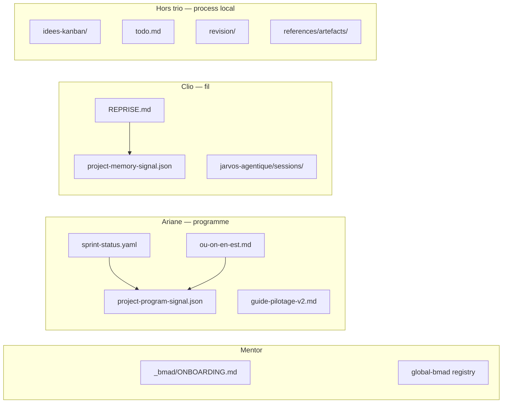

# Proposition Mentor — migration cockpit local → trio BMAD

**Date** : 2026-07-03  
**Projet** : `jarvos-recyclique`  
**Auteur** : Mentor (synthèse explorations + mapping trio)  
**Statut** : proposition — **GO Strophe requis** avant exécution lot 3

> **Note 2026-07-03 (soir)** — Kanban **v2** installé (`docs/ideas/kanban/`, signal `project-kanban-signal.json`). L'ancien `references/idees-kanban/` est archivé ; ce document reste valide pour la répartition trio — seul le chemin kanban change (hors trio inchangé).

---

## 1. Ce que tu avais mis en place (retrouvé)

Tu avais bien un **poste de pilotage local** — pas un dossier `cockpit/` documentaire, mais **plusieurs couches complémentaires** :

| Système | Chemin | Rôle |
|---------|--------|------|
| **Journal métier** | `references/ou-on-en-est.md` | État projet, sessions datées, stratégie v2.0, pivot BMAD |
| **Guide d'exécution** | `_bmad-output/planning-artifacts/guide-pilotage-v2.md` | Jalons, convergences, carte des livrables, rituel MAJ |
| **Grain fin programme** | `_bmad-output/implementation-artifacts/sprint-status.yaml` | SoT stories/epics (`last_updated` 2026-06-07) |
| **Boîte à idées** | `references/idees-kanban/` + skill `.cursor/skills/idees-kanban/` | 17 cartes ouvertes + 7 archivées, stades a-conceptualiser → archive |
| **To-do réflexion** | `references/todo.md` | Hors epics BMAD |
| **Révision terrain HITL** | `references/revision/` | Backlog beta cochable (Epic 28) |
| **Mémoire agentique** | `references/jarvos-agentique/` | Porte d'entrée session, postures Ombre/Archi/Arbitre |
| **Fil court (nouveau)** | `REPRISE.md` | Raccord trio Clio — juillet 2026 |

**Hors scope pilotage doc** : « cockpit » dans Peintre = écrans UI réception/compta.

---

## 2. Diagnostic — ce qui marche / ce qui dérive

| État | Systèmes |
|------|----------|
| **À jour** | `REPRISE.md`, `sprint-status.yaml`, `revision/`, `project-context.md`, `AGENTS.md`, signaux memory, onboarding lot 2 |
| **Actif mais figé** | `ou-on-en-est.md` (**2026-05-30**) — ne couvre pas Epic 28 ni migration BMAD 6.9 |
| **Signal Ariane en retard** | `project-program-signal.json` pointe encore `ou-on-en-est` mai 2026 |
| **Instantanés Kanban** | Dernier snap agrégé **2026-04-23** ; `a-faire/` vide |
| **Triple écriture risque** | YAML (fait) + REPRISE (fil) + ou-on-en-est (journal) — sans règle stricte, drift garanti |

**Conclusion Mentor** : le système pré-existant est **riche et valide** — il ne faut pas le remplacer, mais **répartir les rôles** dans le trio et **geler les doublons**.

---

## 3. Répartition trio (une info = un writer)

| Couche locale | Propriétaire | Règle |
|---------------|--------------|-------|
| État story/epic | **Ariane** → `sprint-status.yaml` | Jamais recopié dans guide ou REPRISE |
| Journal programme métier | **Ariane** → `ou-on-en-est.md` | Sections « Pilotage BMAD » / sessions importantes |
| Règles multi-chantiers | **Ariane** → `guide-pilotage-v2.md` | Cocher jalons aux convergences — pas l'état story |
| Fil reprise repo | **Clio** → `REPRISE.md` | ≤1 écran ; liens, pas copie du journal |
| Fiches session agent | **Clio** → `jarvos-agentique/sessions/` | Tier 2 ; pas diary dans REPRISE |
| Idées immatures | **Hors trio** → `idees-kanban/` | Skill dédié ; archiver quand → story |
| Bugs terrain beta | **revision/** → stories BMAD | Ariane séquence ; Clio note décisions structurantes |
| Onboarding / registre | **Mentor** | `global-bmad/registry/projects/jarvos-recyclique/` |
| Canon implémentation | `_bmad-output/project-context.md` | Agents code — ni fil ni programme |

**Anti-duplication** : Ariane ne touche jamais `project-memory-signal.json` ; Clio ne touche jamais `project-program-signal.json`.

---

## 4. Plan de migration (lots Mentor)

### Lot 3a — Raccordement signaux (spawn duo Ariane + Clio)

**Déclencheur** : GO Strophe sur cette proposition.

| # | Agent | Action | Gate |
|---|-------|--------|------|
| 1 | **Clio** | Enrichir `REPRISE.md` si besoin (liens programme, pas journal) | Fil lisible en <30 s |
| 2 | **Clio** | Republish `project-memory-signal.json` depuis `REPRISE.md` | `source_ref` frais |
| 3 | **Ariane** | Resync `ou-on-en-est.md` § « État actuel / Pilotage BMAD » depuis `sprint-status.yaml` + Epic 28 | Date ≥ 2026-07-03 |
| 4 | **Ariane** | Republish `project-program-signal.json` | Amont déclaré + `updated_at` cohérent |
| 5 | **Mentor** | Copier `_bmad/signals/README.md` + schéma depuis pack JARMES | Fichiers présents |

**Équivalence programme** : conserver `references/ou-on-en-est.md` comme amont (pas de faux `docs/programme/JARVOS_REPRISE.md` sauf stub 10 lignes qui pointe vers ou-on-en-est + YAML — option B si tu préfères la convention pack).

### Lot 3b — Hygiène Kanban & instantanés (optionnel, même session)

| # | Action | Owner |
|---|--------|-------|
| 1 | Nouvelle photo Kanban `artefacts/2026-07-03_04_point-situation-kanban-idees-jarvos.md` | Agent + skill idees-kanban |
| 2 | MAJ `idees-kanban/point-situation.md` (lien vers artefact) | idem |

### Lot 3c — Consolidation registre global (Mentor, script)

- `run_consolidation_v2 --lab` depuis `jarmes-cockpit` quand signaux frais
- Entrée registre : déclarer `program_upstream: references/ou-on-en-est.md`

### Ce qu'on ne migre PAS

| Système | Pourquoi |
|---------|----------|
| `idees-kanban/` → `GLOBAL_IDEAS.md` | Mono-projet actif ; skill local suffit |
| Fusion `ou-on-en-est` dans `REPRISE.md` | Casse la frontière programme/fil |
| Remplacement `guide-pilotage-v2` par sanctums | Couches différentes |
| `jarvos-agentique/` → sanctums trio | Méthodo locale agentique, pas mémoire globale |

---

## 5. Ordre de chargement agent (post-migration)

Conserver et formaliser dans `REPRISE.md` :

1. `REPRISE.md` (fil Clio)
2. `_bmad-output/implementation-artifacts/sprint-status.yaml` (programme)
3. `references/ou-on-en-est.md` (contexte métier si session planification)
4. `_bmad-output/planning-artifacts/guide-pilotage-v2.md` (si multi-chantiers / superviseur)
5. `references/index.md` (ciblé)
6. Idées : `references/idees-kanban/index.md` **uniquement** si session idéation

---

## 6. Décision attendue (Strophe)

- [ ] **GO lot 3a** — spawn duo Ariane + Clio (background, Composer 2.5 Fast)
- [ ] **GO lot 3b** — photo Kanban juillet 2026
- [ ] **Option programme** : garder `ou-on-en-est.md` tel quel **ou** stub `docs/programme/JARVOS_REPRISE.md` pointeur
- [ ] **Reporter** consolidation `global.db` à plus tard

---

## 7. Références

- Pack : `JARMES/jarmes-skills-rules/Skills/jarmes-bmad-trio/docs/programme/ONBOARDING_BROWNFIELD.md` §2.5
- Mentor : `delegation-trio-tasks.md`, `routing-table.md` (TRIO_DELEGATE vs COCKPIT_DOC_ROUTE)
- Kanban : `.cursor/skills/idees-kanban/SKILL.md`
- Porte d'entrée sessions : `references/jarvos-agentique/00-porte-entree-contexte.md`
