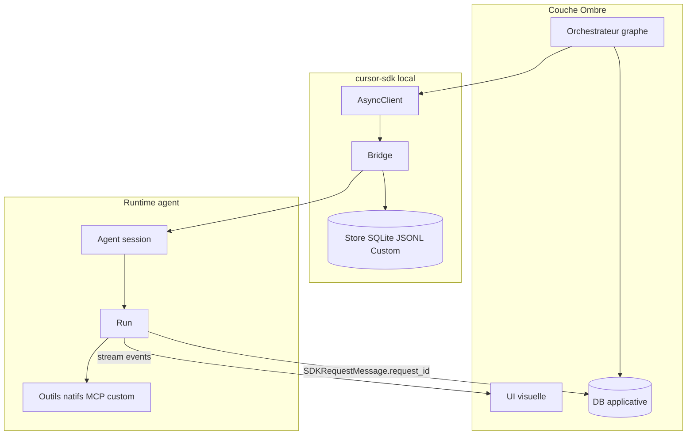

# Référence SDK Cursor Python — local VPS (architecte L'Ombre)

> **Copie canonique JARMES :** [`cursor-sdk-ombre/docs/reference-sdk-cursor-local-vps-architecte-ombre.md`](../../../../JARMES/cursor-sdk-ombre/docs/reference-sdk-cursor-local-vps-architecte-ombre.md) (2026-07-07)

**Date :** 2026-07-07  
**Statut :** référence technique — input design graphes Ombre  
**Audience :** architecte **L'Ombre** (orchestrateur CREOS / JARMES)  
**QA plan source :** gate 95+ (`run_id` `20260707_032500_jarvos_recyclique`, quality 96 / coverage 99)

**Périmètre :** package `cursor-sdk` Python · exécution **locale VPS** (bridge, outils, store). **Zéro cloud applicatif Ombre** (pas de SaaS orchestration / stockage tiers pour graphe, DB, logs). **Inférence LLM via API Cursor** (`CURSOR_API_KEY`) requise — hors périmètre « offline total ».

**Docs officielles :** [cursor.com/docs/sdk/python](https://cursor.com/docs/sdk/python) · changelog juin 2026 (stores, custom tools, nesting) · skill projet [`~/.cursor/skills-cursor/sdk/SKILL.md`](file:///C:/Users/Strophe/.cursor/skills-cursor/sdk/SKILL.md).

**Renvois projet :**
- [`2026-07-05_02_cadrage-bot-discord-la-clique-pilote.md`](2026-07-05_02_cadrage-bot-discord-la-clique-pilote.md) — chaîne Hermes → Ombre → Cursor
- Spec JARMES [`CH-LACLIQUE-BOT-001-spec.md`](../../../../JARMES/docs/programme/CH-LACLIQUE-BOT-001-spec.md)

---

## Table des matières

0. [Cadrage et prérequis VPS](#0-cadrage-et-prérequis-vps)  
1. [Modèle mental](#1-modèle-mental)  
2. [Modes d'invocation](#2-modes-dinvocation)  
3. [Équipement agent](#3-équipement-agent)  
4. [Contexte et prompts](#4-contexte-et-prompts)  
5. [Observabilité](#5-observabilité)  
6. [AsyncClient et topologie VPS](#6-asyncclient-et-topologie-vps)  
7. [Persistance](#7-persistance)  
8. [Graphes d'agents Ombre](#8-graphes-dagents-ombre)  
9. [Interface visuelle](#9-interface-visuelle)  
10. [Sécurité VPS](#10-sécurité-vps)  
11. [Erreurs, pièges, premortem](#11-erreurs-pièges-premortem)  
12. [Référence options](#12-référence-options)  
[Annexe — snippets](#annexe--snippets-sdk-local-vps)

---

## 0. Cadrage et prérequis VPS

**Objectif** : permettre à L'Ombre de designer **graphes d'agents**, **persistance applicative**, **observabilité profonde**, **UI visuelle** — en exploitant **toutes** les facettes du SDK local.

| Prérequis | Détail |
|-----------|--------|
| `CURSOR_API_KEY` | Clé service account dédiée VPS (pas login utilisateur OAuth MCP) |
| `cwd` | Chemin **absolu canonique** du repo sur le VPS |
| Bridge | `cursor-sdk-bridge` — un seul actif par workspace |
| Store | Volume **persistant** (jamais couche conteneur éphémère) |
| Python | 3.10+ · `pip install cursor-sdk` |

**Hors scope** : implémentation code Ombre, choix stack UI/DB, unit systemd — ce document **informe le design** uniquement.

---

## 1. Modèle mental

| Concept | Rôle |
|---------|------|
| **Bridge** | Moteur local (subprocess / sidecar) — exécute agent + outils sur le VPS |
| **Agent** | Session durable — état conversation, config, `agent_id` |
| **Run** | Un tour utilisateur — stream, statut, résultat, annulation |
| **Client sync / AsyncClient** | Télécommande Python ; async = services 24/7 non bloquants |
| **Store** | Persistance locale agents / runs / checkpoints / events |



---

## 2. Modes d'invocation

| Mode | Contrat | Persistance | Usage graphe |
|------|---------|-------------|--------------|
| `Agent.prompt()` | create → 1 send → wait → **dispose** | Volatile usage ; trace technique possible | Nœud feuille jetable |
| `Agent.create()` + `send()`/`wait()` | Session ouverte, multi-tours | Store + `agent_id` | Fil utilisateur long |
| `Agent.resume(id)` | Réattache session | Même `cwd`/workspace + store | Reprise post-crash |

**Règle absolue** : `send()` lance ; `wait()` ou `.text()` récupère. Jamais enchaîner `send()` sans `wait()` (perte réponse si process exit).

**One-shot long** : un seul message user SDK, mais run interne illimité (outils, subagents). Pas de 2e tour sans session.

---

## 3. Équipement agent

### 3.1 Outils natifs (non désactivables)

Famille indicative (noms **runtime produit**, pas symboles API) : shell, read, edit, write, glob, grep, ls, semSearch, spawn subagent (`Agent`/`Task`). **À valider** sur version bridge installée.

Headless = **exécution sans approbation humaine**. Mitigation **empilée** :
- `sandbox_options` — FS limité `cwd`, réseau off sauf allowlist
- hooks `.cursor/hooks.json` — `beforeShellExecution`, `preToolUse`
- `auto_review` + `permissions.json` — deny-by-default shell/write/MCP sensibles ; journaliser allow/block côté Ombre
- sanitize entrée Hermes avant `send` — consignes prompt seules **non garanties** ; salons privilégiés vs publics séparés

### 3.2 MCP

Précédence locale : `mcp_servers` sur **send** (remplace tout) > create > plugins > `.cursor/mcp.json` projet > `~/.cursor/mcp.json` user. **`team`/`mdm` ne chargent pas de serveurs MCP.**

Sans `setting_sources` : inline MCP seulement. **Non persisté** sur `resume` — repasser inline ou `setting_sources` + fichier projet.

OAuth MCP : **interdit headless VPS** — service account uniquement (§10). **`team`/`mdm`** : éviter (config cloud-sync) — rester `project` ou inline. MCP réseau : allowlist hosts + audit serveurs autorisés.

### 3.3 Custom tools (`local.custom_tools`)

Local uniquement · MCP interne `custom-user-tools`. Déclaration → modèle choisit d'appeler → `execute` Python sur VPS → résultat injecté. **Privilège process Ombre** — `input_schema` strict, pas d'I/O sensible sans garde-fous. Visibles aux subagents imbriqués.

### 3.4 Subagents

| Aspect | Règle |
|--------|-------|
| Définitions | Inline `agents={}` ou `.cursor/agents/*.md` (inline prime) |
| Invocations | Jetables — parent reçoit livrable, pas session enfant resumable |
| Champs | `description`, `prompt` (req), `model` (`inherit`), `mcp_servers` |
| Imbrication | Doc juin 2026 = nesting étendu ; doc Python ant. = **cap 2 niveaux** — **à valider sur wheel VPS** |
| Contexte | `SummaryUpdate` stream ; compaction interne Cursor |

---

## 4. Contexte et prompts

| Levier | Effet |
|--------|-------|
| `local.cwd` | Workspace filesystem |
| `setting_sources` | `project` / `user` / `team` / `mdm` / `plugins` / `all` |
| Défaut service | **Aucun** `setting_sources` = inline seulement |
| Message | `agent.send(text)` ou `UserMessage` (+ images) |
| `mode` | `agent` (agit) / `plan` (explore) |
| `model` + `params` | Override send **sticky** |
| System prompt principal | **Pas d'override API** — subagents ou rules via `setting_sources` |

---

## 5. Observabilité

### 5.1 Trois étages

| Étage | API | Usage |
|-------|-----|-------|
| Messages | `run.messages()` / `async for` | UI conversation lisible |
| Deltas | `on_delta`, `on_step` (SendOptions) | Live + étapes terminées |
| Brut | `run.events()` | Offset, rejouabilité, debug |

### 5.2 Familles événements

**SDKMessage** : `system`, `user`, `assistant`, `thinking`, `tool_call`, `status`, `task`, `request`, `usage`

**InteractionUpdate** (`on_delta`) : TextDelta, ThinkingDelta/Completed, ToolCall Started/Completed/Partial, ShellOutputDelta, SummaryStarted/Completed, StepStarted/Completed, TurnEnded, TokenDelta, UserMessageAppended, Unknown

**ConversationStep** (`on_step`) : Assistant, ToolCall, Thinking — `run.conversation()` / `on_step` déclenche par step terminé, pas par tour

**Terminal** : `run.wait()` → `RunResult` ; `run.usage` ; `run.conversation()` / `conversation_json()` ; corrélation **`request_id`** via message stream `type="request"` (`SDKRequestMessage`) et `CursorAgentError.request_id` — pas d'attribut `request_id` documenté sur `Run`/`RunResult` (doc Python courante)

**Debug** : `CURSOR_SDK_LOG=debug|info` ; `cursor-sdk-bridge --help`

**Index logs DB suggéré** : `request_id` + `run_events.offset` (schéma à figer côté Ombre).

**UI** : échapper args/result `tool_call` avant affichage (XSS).

---

## 6. AsyncClient et topologie VPS

| Règle | Détail |
|-------|--------|
| Client | Un `AsyncClient` par event loop — ne pas mélanger sync/async |
| Dev | `AsyncClient.launch_bridge(workspace=...)` |
| Prod | `AsyncClient.connect(base_url, auth_token)` — sidecar systemd |
| Bridge | **Un seul actif par workspace** |
| SPOF | Panne bridge = runs interrompus → `Restart=always`, healthcheck, reprise via **DB Ombre** |
| Workspace | `bridge workspace` = `local.cwd` = list/get/resume — chemin absolu figé |
| `local.force` | Après timeout + `cancel` si possible ; log ; `wait()` post-force ; réconciliation §7 |
| `connect` | **Loopback only** (`127.0.0.1` / `localhost`) — policy Ombre ; doc SDK montre `127.0.0.1` en exemple, pas d'interdiction API distante |

Local : pas de `AgentBusyError` (contrairement cloud).

---

## 7. Persistance

### 7.1 Store SDK

Modèle conceptuel bridge (substores internes — **détail à valider sur wheel**) :

| Substore | Contenu |
|----------|---------|
| agents | Métadonnées + pointeur checkpoint |
| checkpoints | Blobs conversation content-addressed |
| runs | Métadonnées par run |
| run_events | Journal append-only |

| Backend | Usage |
|---------|-------|
| `SqliteLocalAgentStore` | Défaut doc changelog juin 2026 — **symbole à valider sur wheel** |
| `JsonlLocalAgentStore` | Audit, diff, backup — **symbole et structure à valider sur wheel** |
| `LocalAgentStore` custom | **Requis multi-workers** (Postgres, etc.) |

Config : `LocalAgentOptions.store` → bridge. Volume Docker **nommé**, jamais `/tmp` éphémère.

### 7.2 Double persistance Ombre

| Donnée | Store SDK | DB Ombre |
|--------|-----------|----------|
| Conversation / checkpoints | Oui | Non (sauf export) |
| `agent_id` ↔ salon/user/graphe | Réf. | **Canon** |
| État nœud graphe | Non | **Oui** |
| `request_id` (stream `SDKRequestMessage` / erreurs), tokens, durée | Oui + copie | **Analytics** |
| Livrables métier (tickets, IDEAs) | Non | **Oui** |
| Logs structurés | run_events + callbacks | **Index recherche** |

**Réconciliation boot** : nœuds DB `running` vs `client.agents.list()` + dernier run terminal. `agent_id` absent store → nœud `failed`, recréer selon politique. Run terminal `error`/timeout → propager état nœud ; pas de succès silencieux. DB = vérité **orchestration** ; store = vérité **conversation**. Divergence attendue post-crash.

---

## 8. Graphes d'agents Ombre

### 8.1 Typologie nœuds

| Type | SDK | Durée |
|------|-----|-------|
| Feuille one-shot | `Agent.prompt()` ou create+send+close | Run unique |
| Session utilisateur | create + resume `agent_id` | Longue |
| Spécialiste | Subagent | Par délégation |
| Capacité métier | custom_tools / MCP | Permanent |
| Policy | hooks + sandbox + auto_review | Fichier |

### 8.2 Arêtes

`send` · délégation subagent · tool call (natif/MCP/custom) · `resume`

### 8.3 Pool + dispatcher

| Élément | Règle |
|---------|-------|
| Clé routage | Stable en DB : `{graph_id}:{node_id}` ou `{salon}:{user_id}` |
| Création | Lazy `Agent.create` ; persister `agent_id` immédiatement |
| Concurrence | 1 run actif / `agent_id` ; parallélisme = clés distinctes |
| Idempotence | `SendOptions.idempotency_key` = hash `{clé}:{message_id}` |
| Éviction | Politique explicite (N jours ou resume permanent) |
| Subagents | Hors pool — pas d'`agent_id` enfant |

**Profondeur** : cap **2 niveaux** subagents par défaut jusqu'à validation nesting juin 2026.

**Contraintes design** : one-shot = 1 message user SDK (run interne long OK) ; subagents sans mémoire inter-invocation — parent porte le contexte ; MCP send-level override = isolation par étape ; graphe **≠** un seul agent — pool + dispatcher.

**Chaîne cible** (pilote La Clique — voir [`2026-07-05_02`](2026-07-05_02_cadrage-bot-discord-la-clique-pilote.md) · [`CH-LACLIQUE-BOT-001`](../../../../JARMES/docs/programme/CH-LACLIQUE-BOT-001-spec.md)) : salon Discord → **Hermes** → **Ombre (graphe + DB)** → `AsyncClient` → agents Cursor locaux. **Zéro cloud applicatif Ombre** (orchestration, DB, logs) ; inférence LLM via **API Cursor** (`CURSOR_API_KEY`) — cf. périmètre §0. Verrous pilote : spec §3 (TICKET / PROPOSITION / AIDE) · §4.2 (profil **read-only** Cursor/Ombre).

---

## 9. Interface visuelle

| Couche | Source |
|--------|--------|
| Vue session | `client.agents.list`, statut run, modèle |
| Timeline run | `on_step` + `tool_call` (nom, statut, durée) |
| Stream live | `on_delta` + ShellOutputDelta |
| Transcript | `run.conversation()` post-hoc |
| Coût | `usage` par run / cumul |
| Graphe orchestration | **DB Ombre** (pas SDK seul) |

`run.supports(op)` avant cancel/conversation sur runs détachés.

---

## 10. Sécurité VPS

| Couche | Règle |
|--------|-------|
| Sandbox | FS `cwd`, réseau off, allowlist hosts |
| Hooks | Fichier projet — pas callback programmatique |
| Auto-review | deny-by-default + `permissions.json` |
| Headless | Empiler sandbox + hooks + auto_review |
| API key | Service account ; pas dans logs ; hooks bloquent lecture `env` si besoin |
| MCP OAuth | Interdit headless |
| MCP secrets | chmod 600, hors repo |
| Custom tools | Validation entrées, moindre privilège |
| Subagents | Cap profondeur/budget spawn ; timeout délégation ; pas de Task depuis entrée non fiable |
| Bridge connect | Loopback only (policy Ombre §6) |
| No-cloud Ombre | Pas SaaS tiers ; API Cursor = flux sortant assumé — pas de secrets métier dans prompts |
| Artefacts SDK | `list_artifacts` vide en local |

---

## 11. Erreurs, pièges, premortem

**Deux familles** : `CursorAgentError` (jamais démarré) vs `result.status == "error"` (run échoué).

| Piège | Conséquence |
|-------|-------------|
| send sans wait | Pas de réponse |
| workspace bridge ≠ cwd | resume/list vides |
| MCP oublié au resume | Outils absents |
| `setting_sources=["all"]` | Rules user/team non voulues |
| Store éphémère Docker | Perte post-redeploy |
| Multi-workers + SQLite | Corruption |
| tool_call args/result | Non stables — parser défensif ; XSS UI |
| `local.force` sans wait post | Run orphelin, nœud DB bloqué |
| Prompt injection | Shell/MCP/custom déclenchés |
| `custom_tools` sans validation | Code arbitraire VPS |
| `connect` non loopback | Fuite workspace bridge distant |
| Spawn subagent en rafale | Épuisement CPU/RAM/API |
| `CURSOR_API_KEY` dans logs debug | Compromission compte |
| OAuth MCP headless | Auth MCP absente silencieusement |

### Premortem (condensé)

1. Perte historique → volume persistant + chemin absolu  
2. Réponses dupliquées → send/wait + idempotency_key  
3. Graphe bloqué → réconciliation boot + SPOF bridge  
4. Corruption store → custom store avant scale horizontal  
5. Subagent sans MCP → re-injection au resume  
6. Compromission headless → policy empilée + sanitize Hermes  
7. Fuite via MCP/API → allowlist MCP, pas de secrets dans send  

### FMEA (extrait)

| Composant | Défaillance | S | D |
|-----------|-------------|---|---|
| Bridge | Crash mid-run | H | M |
| Dispatcher | agent_id stale | H | L |
| Store | SQLite multi-worker | H | M |
| MCP | Config non persistée au resume | M | L |
| Orchestrateur | send sans wait | H | M |
| Headless | Prompt injection | H | L |
| local.force | Force prématurée | M | L |
| Custom tool | Entrée malveillante | H | M |

**Known limitations doc** : custom tools local only ; hooks fichier only ; tool payloads untyped ; `setting_sources` gates subagents fichier.

**À valider wheel VPS** : nesting subagents ; symboles store (`SqliteLocalAgentStore`, `JsonlLocalAgentStore`) et substores internes ; noms outils natifs runtime.

---

## 12. Référence options

| Type | Champs clés |
|------|-------------|
| `AgentOptions` | model, api_key, name, local, mcp_servers, agents, agent_id, mode |
| `LocalAgentOptions` | cwd, setting_sources, sandbox_options, store, auto_review, custom_tools |
| `SendOptions` | model, mode, mcp_servers, local.force, on_delta, on_step, idempotency_key |
| `AgentDefinition` | description (req), prompt (req), model (`inherit`), mcp_servers |

`AgentOptions.idempotency_key` = cloud only ; `SendOptions.idempotency_key` utilisable en local (retries webhook).

---

## Annexe — snippets SDK (local VPS)

```python
# Agent session (sync)
with Agent.create(
    model="composer-2.5",
    api_key=os.environ["CURSOR_API_KEY"],
    local=LocalAgentOptions(cwd="/opt/jarvos/recyclique"),
) as agent:
    run = agent.send("…")
    run.wait()
```

```python
# Subagent (inline)
agents={
    "reviewer": AgentDefinition(
        description="Revue code — bugs et sécurité",
        prompt="Tu ne modifies rien. Signale les problèmes.",
        model="inherit",
    ),
}
```

```python
# Custom tool (signature)
CustomTool(
    description="…",
    input_schema={"type": "object", "properties": {...}, "required": [...]},
    execute=ma_fonction,
)
```

```python
# Async + bridge (service)
async with await AsyncClient.launch_bridge(workspace="/opt/jarvos/recyclique") as client:
    async with await client.agents.create(model="composer-2.5", local=LocalAgentOptions(cwd="…")) as agent:
        run = await agent.send("…")
        await run.wait()
```
